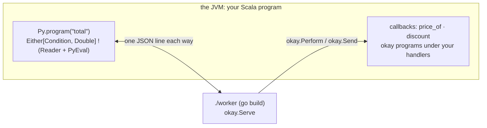

# okay with Go

Go code is mostly services, and a Go runtime does not belong inside the
JVM ([why](rust.md#go)). So Go reaches okay the way Haskell does: as a
**worker process** on okay's line protocol. A Scala program calls Go
programs, and the Go code performs okay's effects in the middle of a
call. Each effect is a callback the Scala side offered, run under the
caller's handlers.

<!-- not-a-test: a diagram -->


## A program as data

The jar ships a small Go package, `okay`, written with the standard library
only. A program is `okay.Prog`: `Done` answers, and `Perform` asks okay to
run a named operation and continues with its answer:

```go
func pairs(_ []any) okay.Prog {
	return okay.Perform("choose", []any{1, 2}).Then(func(x any) okay.Prog {
		return okay.Perform("choose", []any{10, 20}).Then(func(y any) okay.Prog {
			return okay.Done(x.(int64) + y.(int64))
		})
	})
}
```

A continuation is an ordinary Go closure. The worker keeps it under an id
until okay forgets the run, so okay may continue it more than once. A
`Choice` handler on the Scala side makes all four branches of `pairs`.

## Typed operations

`Perform` names an operation by a string and answers `any`. The typed form
is `okay.Program[A]`, with `okay.Send` for one operation and `okay.Bind` to
sequence them. You do not write the operations: `Go.ops` writes them from
the Scala callbacks that answer them:

```scala
  val priceOf = Py.callback[String, Double]("price_of")(sku => Reader.ask[Map[String, Double]].map(_(sku)))
```

`Go.ops("shop", Py.callbacks(priceOf, discount))` is a package `shop` with
`func PriceOf(a0 string) okay.Op[float64]`, and the Go program uses it:

```go
func total(sku string, qty int64) okay.Program[float64] {
	return okay.Bind(okay.Send(shop.PriceOf(sku)), func(price float64) okay.Program[float64] {
		return okay.Send(shop.Discount(price * float64(qty)))
	})
}
```

- **What the compiler checks.** `go build` refuses `shop.PriceOf(qty)`,
  because an `int64` is not a `string`, and `price` is a `float64`
  because the Scala callback answers a `Double`.
- **What it cannot check.** Go has no type-level lists, so a program's
  SET of operations cannot be in its type. Haskell's and TypeScript's
  can ([where each language names okay's effects](jvm-languages.md#where-each-language-names-okays-effects)).

## From Scala

`GoWorker.build(dir)` writes the `okay` package into `dir` (and a `go.mod`
naming the module `worker` if there is none) and runs `go build`. The
build is offline: standard library only, with `GOTOOLCHAIN=local`.
`PySubprocess.speaking(Seq(binary))` runs the worker, and everything
okay-py does works unchanged:
- `Py.program` and callbacks;
- multi-shot handlers;
- `Durable` journals.

A Go `panic` in a program arrives as a condition, `GoError`, with its
message, and the worker keeps running.

## What comes next

`GOOS=wasip1 GOARCH=wasm go build` compiles Go to WebAssembly without
TinyGo. Run by Chicory inside the JVM, that is the road for untrusted Go
plugins, shared with Rust ([okay with Rust](rust.md)).

The design and its results: [specs/polyglot-go.md](../specs/polyglot-go.md).
