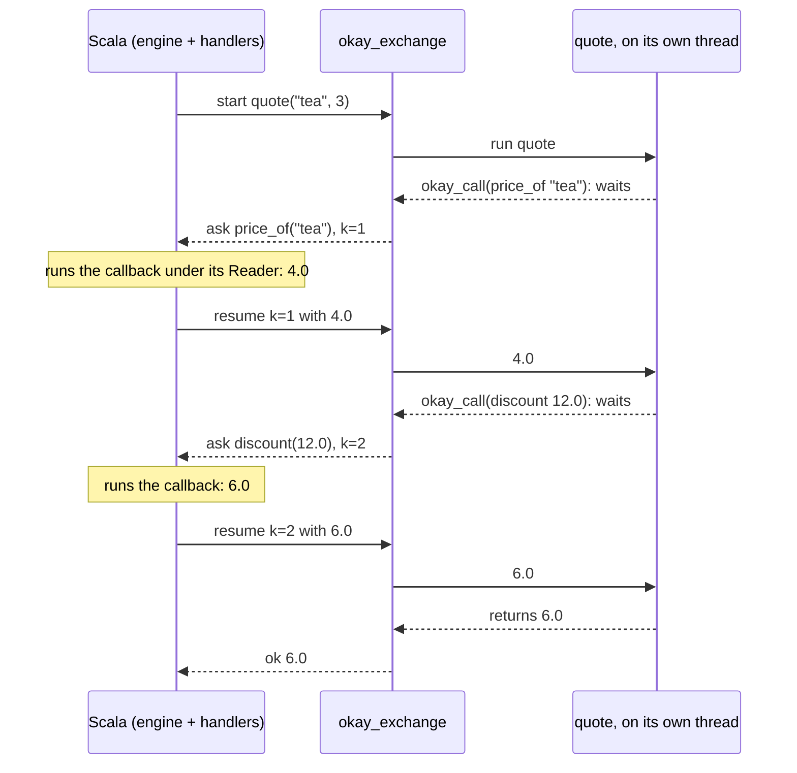

# Rust and Go as okay

okay's effects are Scala's. This page is about Rust and Go code that
takes part in them as if it were written in the same language. It is
called with types, it calls okay's effects in the middle of its work, and
okay may resume it more than once. How it is reached is a choice made at
the edge, not something the program has to know:

| how Scala reaches it | Rust | Go |
|---|---|---|
| a child process, over its pipes | ✅ | ✅ |
| TCP, another process or another machine | ✅ | ✅ |
| in this process, native code through FFM | ✅ | — a Go runtime does not belong in the JVM ([why](rust.md#go)) |
| in this process, WebAssembly under Chicory | ✅ programs as data (no threads in wasip1, so no direct style) | ✅ |

## One program, two languages

The far side serves `quote(sku, qty)`. It is ordinary code that calls two
of okay's effects (a price, a discount) and gets their answers: the
direct style, `okay_call(request) -> answer`.

In Rust:

```rust
    functions.insert("quote".into(), function(|args| {
        let sku = String::from_value(&args[0])?;
        let qty = i64::from_value(&args[1])?;
        let price = okay_call(ops::price_of(sku))?;
        let total = okay_call(ops::discount(price * qty as f64))?;
        Ok(total.to_value())
    }));
```

In Go:

```go
func quote(c *okay.Ctx, args []any) any {
	price, err := okay.Call(c, shop.PriceOf(args[0].(string)))
	if err != nil {
		panic(err)
	}
	total, err := okay.Call(c, shop.Discount(price*float64(args[1].(int64))))
	if err != nil {
		panic(err)
	}
	return total
}
```

`ops::price_of` and `shop.PriceOf` are not written by hand. `Rs.ops` and
`Go.ops` generate them from the Scala callbacks that answer them, so an
argument of the wrong type does not compile, and `price` has the type of
the callback's answer. The effects are declared ONCE, in Scala:

```scala
  val priceOf = Foreign.callback[String, Double]("price_of")(sku => Reader.ask[Map[String, Double]].map(_(sku)))
```

## The same Scala, over every link

The engine is `ForeignWorker`, and only its link changes. Pick ONE of
these, by where the worker runs.

A child process that okay starts itself, speaking on its stdin and
stdout (no port, no network):

```scala
  lazy val engine: ForeignWorker = ForeignWorker.speaking(Seq(GoWorkerBinary.binary.toString))
```

A worker already serving TCP, on this machine or another one (a Go or
Rust binary started with `OKAY_LISTEN=host:port`). The engine is one
line, whatever started the server:

```scala
        val engine = ForeignWorker.connect("127.0.0.1", port)
```

A Rust library loaded into THIS process through FFM:

```scala
    ForeignWorker.over(InProcessLinks.ffm(NativeLib.load(RustInProcess.dylib)).fold(why => throw IllegalStateException(why), identity))
```

A Rust or Go module compiled to WebAssembly, run in this process:

```scala
    ForeignWorker.over(InProcessLinks.wasm(WasmLib.load(Files.readAllBytes(GoInProcess.wasm))))
```

The call is then the same everywhere:
`Foreign.fn[Double]("quote").calling(Foreign.callbacks(priceOf, discount))("tea", 3L)`
runs `quote` in Rust or Go. Each `okay_call` is answered by a Scala
callback under the caller's handlers (here, a `Reader` of prices). The
same holds for programs as data (`Foreign.program`), which a `Choice`
handler resumes on every branch, and for `Durable` journals.

## How it is held to that

ONE Scala test body, `WireConformance`, runs over every cell of the table.
It checks four things:
- multi-shot across the link, every branch of two choices;
- each operation answered by a Scala callback under the caller's Reader;
- direct style, `okay_call` twice;
- a failure: a condition by name, with the far side living on. Rust
  compiled to WebAssembly is the exception: its panic traps the module,
  and the test holds that the panic's own message is reported.

A mutant was caught on each link while it was built. One mutant was not
caught at first, and that found a real defect: the engine read wire
lines with a repairing JSON parser, so a reply cut one byte short passed.
Wire lines are now read strictly, on every transport.

## The wire's encoding, chosen by a given

The wire's format and compression are chosen with an import. The
imports are givens that the engine's `start`, `speaking`, `connect` and
`over` take as `using` parameters.

**With no import, the wire is JSON compressed with raw DEFLATE**
(RFC 1951), wherever that is possible:

```scala
  lazy val engine: ForeignWorker = ForeignWorker.start(TestPy.python.get, modules = Seq(PyConformance.conf))
```

```scala
    assertEquals(engine.wire, "json/deflate")
```

The default is a PREFERENCE, and an ordered one: raw DEFLATE where the
far side speaks it, else zlib (RFC 1950: the same DEFLATE with a header
and a checksum, which is what R can check natively), else nothing. R
settles on zlib:

```scala
  def expected = "json/zlib"
```

A far side with neither (Haskell, a worker older than this) keeps the
plain JSON lines, and nothing is refused:

```scala
    assertEquals(engine.wire, "json/none")
```

An in-process link (Rust over FFM, Rust or Go on WebAssembly) does not
compress by default either: a message there is a copy in memory, and
compressing it would cost CPU and save nothing. `ForeignWorker.wire`
always says what the handshake settled on.

To turn compression off, import `Off`:

```scala
  import WireCompression.Off.given
```

For CBOR (RFC 8949) instead of JSON, or for DEFLATE as a REQUIREMENT
rather than a preference, the imports are:

```scala
  import WireFormat.Cbor.given
  import WireCompression.Deflate.given
```

Nothing else in the program changes.

The far side cannot import a Scala given, so it ANNOUNCES what it speaks
in its hello: `"speaks":{"format":["json","cbor"],"compress":["deflate"]}`.
The engine then sends one `configure` request as a JSON line. The far
side answers it in the old mode and switches after the answer. From then
on every message is a frame: a 4-byte big-endian length, then the bytes.
An EXPLICIT choice that the far side did not announce is refused by name
before any request is sent, and never quietly downgraded:

```scala
    val e = intercept[IllegalStateException](ForeignWorker.speaking(Seq(HsConformance.binary)))
    assert(e.getMessage.contains("given WireCompression is deflate"), e.getMessage)
```

Each far side uses its own platform's mechanism. None needs a package
the language does not already ship:

| Far side   | CBOR                               | DEFLATE                     | Links tested                    |
|------------|------------------------------------|-----------------------------|---------------------------------|
| Python     | its own subset (struct)            | zlib, `wbits=-15`           | pipes                           |
| TypeScript | its own subset (Buffer)            | `node:zlib` raw             | pipes                           |
| Go         | its own subset                     | `compress/flate`            | pipes, TCP, WebAssembly         |
| Rust       | its own subset over serde_json     | flate2 (pure Rust backend)  | pipes, TCP, FFM, WebAssembly    |
| Haskell    | its own subset (bytestring, text)  | none: GHC ships no zlib     | pipes                           |
| R          | its own subset (readBin, writeBin) | zlib (`memCompress`), not raw | pipes                         |

The "subset" in each row is the same: integers, floats (half, single,
double), text, definite arrays and maps with text keys, and
true/false/null. The tree is the one JSON carries, escapes included.
So `{"t":"int"}` for an integer past 2^53 means the same thing in both
formats, and the conformance suite (`WireConformance`) runs unchanged
under each: `TestGoPipesCbor`, `TestRustFfmCbor`, `TestPyPipesCbor`,
`TestTsPipesCbor`, `TestHsPipesCbor` and the rest.

Why a given rather than a flag: the choice is fixed where the program is
compiled, and the compiler carries it to every engine the program
builds. A missing or ambiguous choice is a compile error, not a run-time
surprise. This is the implicit calculus's point: the context is resolved
by type, in scope, and passed without being written at each call
(Oliveira et al., "The implicit calculus", PLDI 2012,
doi:10.1145/2254064.2254070; Odersky et al., "Simplicitly: foundations
and applications of implicit function types", POPL 2018,
doi:10.1145/3158130). The formats themselves: C. Bormann and P. Hoffman,
RFC 8949, "Concise Binary Object Representation (CBOR)", 2020,
doi:10.17487/RFC8949; P. Deutsch, RFC 1951, "DEFLATE Compressed Data
Format Specification", 1996, doi:10.17487/RFC1951; P. Deutsch and
J.-L. Gailly, RFC 1950, "ZLIB Compressed Data Format Specification",
1996, doi:10.17487/RFC1950.

**R** has its own engine (`okay.r.RSubprocess`), and it takes the same
givens; the codecs live in okay-codec (`okay.codec.WireFormat`,
`okay.codec.WireCompression`), and `okay.py` keeps the names. Two things
about R are worth knowing:
- Base R cannot inflate raw DEFLATE safely. `gzcon` over a hand-made gzip
  header prints a CRC error per message and accepts a cut stream, and
  `memDecompress` on a hand-wrapped member was killed for memory. zlib,
  which `memDecompress` checks, is why the preference has a second step.
- R's CBOR encodes the tree jsonlite would print, so both formats carry
  the same values. One suite runs over all four wires R speaks
  (`TestRWireDefault`, `TestRWireOff`, `TestRWireCbor`,
  `TestRWireCborPlain`). It found that doubles had always left R rounded
  to 15 significant digits (jsonlite's `digits = NA`), so `sqrt(2)`
  arrived as 1.4142135623731. They now leave with 17, which is what a
  double needs to come back as itself.

## One `okay_call`, step by step

In-process, the Scala side can do exactly one thing with the loaded Rust
library: call `okay_exchange(message) -> answer`. It is an ordinary C
function. It takes bytes, returns bytes, and is finished. Rust cannot
call Scala; it can only answer. Yet `quote` needs a price, which only
Scala's `Reader` knows, in the MIDDLE of its work. The way through is to
spread one `quote` over several `okay_exchange` calls:

<!-- not-a-test: a diagram of the messages -->


1. `start`: the worker runs `quote` on a thread of its own. At its first
   `okay_call`, that thread stops and waits on a channel. `okay_exchange`
   RETURNS to Scala with an `ask` naming the operation and its arguments.
2. Scala runs the callback as an ordinary okay program, under its own
   handlers (`Reader`, `State`, ...), and gets the answer.
3. `resume`: the next `okay_exchange` hands the answer over. The waiting
   thread wakes up, `okay_call` returns the answer, and `quote` goes on,
   until its next `okay_call` (another `ask`) or its end (`ok`).

The thread is what holds `quote`'s place. Rust cannot pause a function
halfway and come back to it later, but a waiting thread keeps its whole
stack alive: `sku`, `qty`, and the line it stopped on. Over pipes or TCP
the dialogue is the same messages, each a line or a frame instead of a
call.

## Why a dialogue, even in-process

`okay_call` in this process could have been a C upcall into the JVM. It
is not, and the reason is okay's, not FFM's. A callback is an okay
PROGRAM that must run under ALL the caller's handlers. An upcall arriving
in the middle of a foreign call would run it under the foreign engine's
handler alone, with its `Reader`, `State` or `Async` missing. So every
transport carries the same `ask`/`resume` dialogue, and in-process each
step is one function call.

## Limits

- **Remote TCP is plain TCP, unauthenticated.** Use it inside a trusted
  network or behind TLS or SSH. Encryption and authorization chosen by
  `given`s are the next stage
  ([specs/polyglot-one-wire.md](../specs/polyglot-one-wire.md)).
- **No read deadline.** A far side that stops answering (or confirms a
  `configure` and does not switch) leaves the engine waiting. The
  gate's stall watchdog is what caught that mutant.
- **Rust on WebAssembly.** No direct style, and a panic ends the module.
- **Go in-process.** Only as WebAssembly.

More on each: [okay with Rust](rust.md), [okay with Go](go.md), and
[where each language names okay's effects](jvm-languages.md#where-each-language-names-okays-effects).
