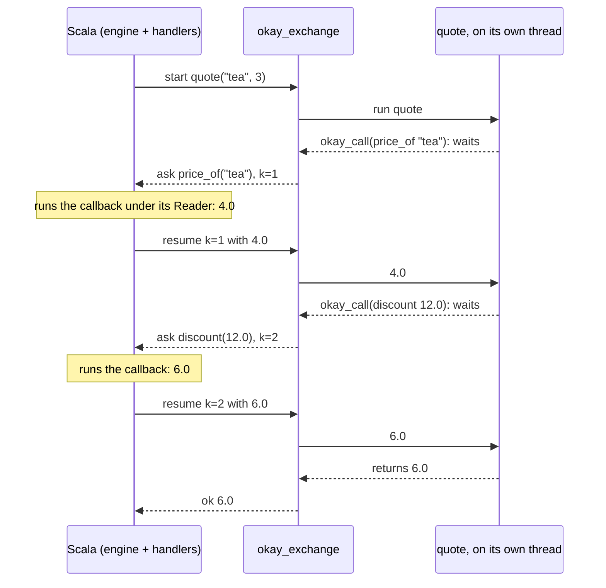

# Rust and Go as okay

okay's effects are Scala's. This page is about Rust and Go code that
takes part in them as if it were written in the same language. It is
called with types, it calls okay's effects in the middle of its work, and
okay may resume it more than once. How it is reached is a choice made at
the edge, not something the program has to know:

| how Scala reaches it | Rust | Go |
|---|---|---|
| a child process, over its pipes | ✅ | ✅ |
| TCP, another process or another machine | ✅ | ✅ |
| in this process, native code through FFM | ✅ | — a Go runtime does not belong in the JVM ([why](rust.md#go)) |
| in this process, WebAssembly under Chicory | ✅ programs as data (no threads in wasip1, so no direct style) | ✅ |

## One program, two languages

The far side serves `quote(sku, qty)`. It is ordinary code that calls two
of okay's effects (a price, a discount) and gets their answers: the
direct style, `okay_call(request) -> answer`.

In Rust:

```rust
    functions.insert("quote".into(), function(|args| {
        let sku = String::from_value(&args[0])?;
        let qty = i64::from_value(&args[1])?;
        let price = okay_call(ops::price_of(sku))?;
        let total = okay_call(ops::discount(price * qty as f64))?;
        Ok(total.to_value())
    }));
```

In Go:

```go
func quote(c *okay.Ctx, args []any) any {
	price, err := okay.Call(c, shop.PriceOf(args[0].(string)))
	if err != nil {
		panic(err)
	}
	total, err := okay.Call(c, shop.Discount(price*float64(args[1].(int64))))
	if err != nil {
		panic(err)
	}
	return total
}
```

`ops::price_of` and `shop.PriceOf` are not written by hand. `Rs.ops` and
`Go.ops` generate them from the Scala callbacks that answer them, so an
argument of the wrong type does not compile, and `price` has the type of
the callback's answer. The effects are declared ONCE, in Scala:

```scala
  val priceOf = Foreign.callback[String, Double]("price_of")(sku => Reader.ask[Map[String, Double]].map(_(sku)))
```

## The same Scala, over every link

The engine is `ForeignWorker`, and only its link changes. Pick ONE of
these, by where the worker runs.

A child process that okay starts itself, speaking on its stdin and
stdout (no port, no network):

```scala
  lazy val engine: ForeignWorker = ForeignWorker.speaking(Seq(GoWorkerBinary.binary.toString))
```

A worker already serving TCP, on this machine or another one (a Go or
Rust binary started with `OKAY_LISTEN=host:port`). The engine is one
line, whatever started the server:

```scala
        val engine = ForeignWorker.connect("127.0.0.1", port)
```

A Rust library loaded into THIS process through FFM, one line after
`import okay.rust.*` (no port, no process, no `connect`):

```scala
    ForeignWorker.inProcess(RustInProcess.dylib)
```

A Rust or Go module compiled to WebAssembly, run in this process:

```scala
    ForeignWorker.inProcessWasm(GoInProcess.wasm)
```

A file that is not an okay worker (no `okay_exchange`: a plain kernel,
say) is refused by name and closed. Both are `ForeignWorker.over` on the
links `InProcessLinks.ffm` and `InProcessLinks.wasm`, which remain there
for a library already loaded some other way.

The call is then the same everywhere:
`Foreign.fn[Double]("quote").calling(Foreign.callbacks(priceOf, discount))("tea", 3L)`
runs `quote` in Rust or Go. Each `okay_call` is answered by a Scala
callback under the caller's handlers (here, a `Reader` of prices). The
same holds for programs as data (`Foreign.program`), which a `Choice`
handler resumes on every branch, and for `Durable` journals.

## How it is held to that

ONE Scala test body, `WireConformance`, runs over every cell of the table.
It checks four things:
- multi-shot across the link, every branch of two choices;
- each operation answered by a Scala callback under the caller's Reader;
- direct style, `okay_call` twice;
- a failure: a condition by name, with the far side living on. Rust
  compiled to WebAssembly is the exception: its panic traps the module,
  and the test holds that the panic's own message is reported.

A mutant was caught on each link while it was built. One mutant was not
caught at first, and that found a real defect: the engine read wire
lines with a repairing JSON parser, so a reply cut one byte short passed.
Wire lines are now read strictly, on every transport.

## The wire's encoding, chosen by a given

The wire's format and compression are chosen with an import. The
imports are givens that the engine's `start`, `speaking`, `connect` and
`over` take as `using` parameters.

**With no import, the wire is JSON compressed with raw DEFLATE**
(RFC 1951), wherever that is possible:

```scala
  lazy val engine: ForeignWorker = ForeignWorker.start(TestPy.python.get, modules = Seq(PyConformance.conf))
```

```scala
    assertEquals(engine.wire, "json/deflate")
```

The default is a PREFERENCE, and an ordered one: raw DEFLATE where the
far side speaks it, else zlib (RFC 1950: the same DEFLATE with a header
and a checksum, which is what R can check natively), else nothing. R
settles on zlib:

```scala
  def expected = "json/zlib"
```

A far side with neither (Haskell, a worker older than this) keeps the
plain JSON lines, and nothing is refused:

```scala
    assertEquals(engine.wire, "json/none")
```

An in-process link (Rust over FFM, Rust or Go on WebAssembly) does not
compress by default either: a message there is a copy in memory, and
compressing it would cost CPU and save nothing. `ForeignWorker.wire`
always says what the handshake settled on.

To turn compression off, import `Off`:

```scala
  import WireCompression.Off.given
```

For CBOR (RFC 8949) instead of JSON, or for DEFLATE as a REQUIREMENT
rather than a preference, the imports are:

```scala
  import WireFormat.Cbor.given
  import WireCompression.Deflate.given
```

Nothing else in the program changes.

The far side cannot import a Scala given, so it ANNOUNCES what it speaks
in its hello: `"speaks":{"format":["json","cbor"],"compress":["deflate"]}`.
The engine then sends one `configure` request as a JSON line. The far
side answers it in the old mode and switches after the answer. From then
on every message is a frame: a 4-byte big-endian length, then the bytes.
An EXPLICIT choice that the far side did not announce is refused by name
before any request is sent, and never quietly downgraded:

```scala
    val e = intercept[IllegalStateException](ForeignWorker.speaking(Seq(HsConformance.binary)))
    assert(e.getMessage.contains("given WireCompression is deflate"), e.getMessage)
```

Each far side uses its own platform's mechanism. None needs a package
the language does not already ship:

| Far side   | CBOR                               | DEFLATE                     | Links tested                    |
|------------|------------------------------------|-----------------------------|---------------------------------|
| Python     | its own subset (struct)            | zlib, `wbits=-15`           | pipes                           |
| TypeScript | its own subset (Buffer)            | `node:zlib` raw             | pipes                           |
| Go         | its own subset                     | `compress/flate`            | pipes, TCP, WebAssembly         |
| Rust       | its own subset over serde_json     | flate2 (pure Rust backend)  | pipes, TCP, FFM, WebAssembly    |
| Haskell    | its own subset (bytestring, text)  | none: GHC ships no zlib     | pipes                           |
| R          | its own subset (readBin, writeBin) | zlib (`memCompress`), not raw | pipes                         |

The "subset" in each row is the same: integers, floats (half, single,
double), text, definite arrays and maps with text keys, and
true/false/null. The tree is the one JSON carries, escapes included.
So `{"t":"int"}` for an integer past 2^53 means the same thing in both
formats, and the conformance suite (`WireConformance`) runs unchanged
under each: `TestGoPipesCbor`, `TestRustFfmCbor`, `TestPyPipesCbor`,
`TestTsPipesCbor`, `TestHsPipesCbor` and the rest.

Why a given rather than a flag: the choice is fixed where the program is
compiled, and the compiler carries it to every engine the program
builds. A missing or ambiguous choice is a compile error, not a run-time
surprise. This is the implicit calculus's point: the context is resolved
by type, in scope, and passed without being written at each call
(Oliveira et al., "The implicit calculus", PLDI 2012,
doi:10.1145/2254064.2254070; Odersky et al., "Simplicitly: foundations
and applications of implicit function types", POPL 2018,
doi:10.1145/3158130). The formats themselves: C. Bormann and P. Hoffman,
RFC 8949, "Concise Binary Object Representation (CBOR)", 2020,
doi:10.17487/RFC8949; P. Deutsch, RFC 1951, "DEFLATE Compressed Data
Format Specification", 1996, doi:10.17487/RFC1951; P. Deutsch and
J.-L. Gailly, RFC 1950, "ZLIB Compressed Data Format Specification",
1996, doi:10.17487/RFC1950.

**R** has its own engine (`okay.r.RSubprocess`), and it takes the same
givens; the codecs live in okay-codec (`okay.codec.WireFormat`,
`okay.codec.WireCompression`), and `okay.py` keeps the names. Two things
about R are worth knowing:
- Base R cannot inflate raw DEFLATE safely. `gzcon` over a hand-made gzip
  header prints a CRC error per message and accepts a cut stream, and
  `memDecompress` on a hand-wrapped member was killed for memory. zlib,
  which `memDecompress` checks, is why the preference has a second step.
- R's CBOR encodes the tree jsonlite would print, so both formats carry
  the same values. One suite runs over all four wires R speaks
  (`TestRWireDefault`, `TestRWireOff`, `TestRWireCbor`,
  `TestRWireCborPlain`). It found that doubles had always left R rounded
  to 15 significant digits (jsonlite's `digits = NA`), so `sqrt(2)`
  arrived as 1.4142135623731. They now leave with 17, which is what a
  double needs to come back as itself.

## Who may speak: `WireAuth`

A worker serving TCP can be reached by anyone who can reach its port. To
let only holders of a secret speak to it, start it with the secret in its
environment, `OKAY_WIRE_SECRET` (or `OKAY_WIRE_SECRET_FILE`, a path), and
give the Scala side the same secret as a given:

```scala
  given WireAuth = WireAuth.secret("tea for two".getBytes)
```

```scala
  private lazy val served = GoWorkerBinary.listen(Map("OKAY_WIRE_SECRET" -> "tea for two"))
  lazy val engine: ForeignWorker = ForeignWorker.connect("127.0.0.1", served._1)
```

In a real program the secret comes from where secrets live, and each
source is its own given: `WireAuth.fromEnv("OKAY_WIRE_SECRET")` or
`WireAuth.fromFile(Path.of("/run/secrets/okay"))`. A source that has no
secret (an unset variable, an empty file) fails when the worker is
opened, by name, instead of authenticating with an empty key.

The handshake is a MUTUAL challenge. The server's hello carries a random
nonce `Ns`. The host answers with its own nonce `Nc` and
`HMAC-SHA256(secret, "okay-wire client|Ns|Nc")`. The server checks it in
constant time and answers `HMAC-SHA256(secret, "okay-wire server|Ns|Nc")`,
which the host checks in turn. The secret itself never crosses. The two
labels differ so that neither answer can be replayed as the other (a
reflection). Until the host has passed, the server answers every other
request with a refusal, and a wrong mac closes the connection.

Mismatches are refused by name before any request is sent. A server that
demands a secret meets a host with no given: "requires hmac-sha256
authentication; this host has no given WireAuth". A host whose given
demands one meets a server that announced none: "it announced none".
Both sides check. With the server's own check disabled (the mutant this
lane ran), the connection was still refused, by the host, because the
server's answer did not prove the secret.

What it does NOT give: secrecy. The messages after the handshake are
still plain TCP, and a relay in the middle could pass the handshake
through. Encryption (TLS, `given WireSecurity`, below) is the layer for
that, and the two compose. Pipe workers and in-process links take no auth: the
host started the process itself, or shares its address space, so there
is no one else on the line.

The construction is HMAC (M. Bellare, R. Canetti and H. Krawczyk,
"Keying Hash Functions for Message Authentication", CRYPTO 1996,
doi:10.1007/3-540-68697-5_1; RFC 2104, doi:10.17487/RFC2104; checked
against RFC 4231's vectors, doi:10.17487/RFC4231). The two-nonce
exchange with role labels is the classic defence against reflection in
two-party authentication (R. Bird et al., "Systematic Design of Two-Party
Authentication Protocols", CRYPTO 1991, doi:10.1007/3-540-46766-1_3).

## Encryption: `WireSecurity`

TLS on a TCP link is a given as well, and its trust names its own
source:

```scala
  given WireSecurity = WireSecurity.tls(WireSecurity.Trust.pem(TestTlsCerts.server.get.cert))
```

`Trust.pem(path)` is a private CA's certificate, or the server's own
self-signed one. `Trust.pemFromEnv(name)` is a path held in an
environment variable. `Trust.system` is the JDK's store, for a server
with a certificate from a public CA. The call is `connect` as before:

```scala
  lazy val engine: ForeignWorker = ForeignWorker.connect("127.0.0.1", served._1)
```

The server serves TLS when it is started with `OKAY_TLS_CERT` and
`OKAY_TLS_KEY` (PEM files). Go uses `crypto/tls`. Rust uses rustls,
behind the okay crate's `tls` feature, so a worker that does not use TLS
does not compile it: `RustWorker.build(dir, features = Seq("tls"))`. A
Rust worker built without the feature and asked for TLS refuses to start,
and names that switch.

The host checks the server's NAME, not only its chain (the rules HTTPS
uses: the name dialled must be in the certificate). A trusted
certificate issued for another name is refused. Each mismatch is refused
by name:
- a TLS host meeting a plain server: "did not complete a TLS handshake";
- a trust that does not cover the server's certificate: the same,
  naming the trust's source;
- a PLAIN host meeting a TLS server. A TLS server waits for the client to
  speak first, so no hello ever comes. The TCP link's hello read has a
  limit (the `WireDeadline` if one is given, else 10 s), and the refusal
  says: "does it serve TLS? (this host's given WireSecurity is plain)".

TLS and `WireAuth` compose. TLS proves the SERVER and hides the traffic.
The HMAC challenge proves the CLIENT. Together they give a wire both
sides have proved and nobody can read, so a client certificate (mTLS)
adds nothing here that the secret does not. The tests run the whole
conformance suite over TLS, and over TLS with a secret, on Go and on
Rust.

The protocol is TLS 1.3 (E. Rescorla, RFC 8446, 2018,
doi:10.17487/RFC8446), with 1.2 still accepted. The name check is RFC
6125's (P. Saint-Andre and J. Hodges, 2011, doi:10.17487/RFC6125).

## When the far side fails: deadlines and recovery

Two things go wrong with a far side: it goes SILENT (a hung call, a
network that stopped delivering), or it DIES (a crash, a killed process, a
dropped connection). okay's answer is the one it gives everywhere else:
the failure is data, and what to do about it is the caller's choice.

**A deadline** is a given:

```scala
    given WireDeadline = WireDeadline.after(500.millis)
```

A call that does not answer in time answers `Left(Condition("timeout",
...))`, and the engine is dead after it: the only way to abandon a
blocked read on a pipe or a socket is to close the wire. Without the
given there is no deadline, as before. In-process there is no deadline at
all: a call into a library runs on the caller's thread and cannot be
abandoned, so a deadline there is refused by name rather than promised.

**A supervised worker** comes back after a death or a timeout. `open` is
whatever made the worker (a child process, a connection), and it is
called again with the same givens:

```scala
    val w = ForeignWorker.supervised(ForeignWorker.connect("127.0.0.1", port))
```

What survives a restart depends on what was running:

- **Programs as data survive, even mid-run.** A far-side program is a pure
  function of the answers it was given. A continuation is therefore fully
  described by its program (`fn`, `args`) and the PATH of answers that
  reached it. The supervisor records those paths. On a fresh worker it
  re-runs the program and replays the path, which re-derives the
  continuation, and then continues. The tests kill a Python worker's
  process, and a Go server (brought back on the same port), in the middle
  of a multi-shot program: every branch of a `Choice` still comes back. A
  replay that meets a different operation than the one recorded means the
  far side is not deterministic, and it answers
  `Condition("ReplayDrift", ...)`, never a wrong value.
- **A plain call caught in the failure answers
  `Condition("WorkerDied" | "timeout", ...)`.** That covers `Call`,
  `Frame`, and a direct-style call waiting in `okay_call`, whose far-side
  frame died with the process. Whether to call again is the caller's
  decision, because the far side may have done the work before it went
  silent. okay-platform's `retry(policy)(...)` is the tool when doing it
  twice is harmless.
- **A held object does not survive.** It names state inside one process.
  A ref from before a restart is refused by name ("belongs to a worker
  that is gone"). Refs carry their generation, so a stale ref is never
  pointed at whatever the fresh process happens to number the same.

This is log-based rollback recovery under the piecewise-deterministic
assumption (E. N. Elnozahy, L. Alvisi, Y.-M. Wang and D. B. Johnson, "A
Survey of Rollback-Recovery Protocols in Message-Passing Systems", ACM
Computing Surveys 34(3), 2002, doi:10.1145/568522.568525). The recorded
answers are the log, and the far side's purity makes each replayed step
arrive where it did before. It is the same journal-of-answers idea as
okay's `Durable`. Restarting what died and letting the caller decide is
Erlang's supervision (J. Armstrong, "Making reliable distributed systems
in the presence of software errors", PhD thesis, KTH, 2003).

## A foreign call as a workflow activity

okay's durable workflows (`Wf`, journalled in a topic by
`okay.persist.Dialogue`) ask questions and remember the answers. An
ACTIVITY in a workflow engine is exactly that: a command performed
outside and a result remembered. So a foreign call needs no mechanism of
its own. It is a question, `ForeignCall`, and the worker is the oracle
(module okay-foreign-workflow). The workflow is written in do-notation:

```scala
  def order(sku: String)(using w: Wf.Asks[ForeignCall, String, String, Pure]): String ! Delim + Pure = direct:
    val price = !ForeignActivity.call[Double]("shop:price")(sku)
    price match
      case Left(c) => s"no price: ${c.kind}"
      case Right(p) =>
        val total = !ForeignActivity.call[Double]("shop:total")(p, 3L)
        total.fold(c => s"no total: ${c.kind}", t => s"total $t")
```

It is run by the ordinary workflow driver, with the oracle under
whichever worker is installed (Python here; Go, Rust and the others in
the same way, supervised or not, over any link and any givens):

```scala
    val run = Dialogue.workflow[ForeignCall, String, String, Pure](topic, "order-1", "order/1")(order("tea"))
      .runWorkflowIn(q => ForeignActivity.oracle(q))
```

What the durable layers now give a foreign call:
- **Crash-resume.** Every answer is in the topic. A host that dies after
  the first activity resumes from the journal, and the far function is
  not called again. The test counts its calls on the far side.
- **Failures that mean something are remembered.** An exception the far
  function raised (`KeyError` for an unknown product) is a journalled
  answer. The workflow branches on it, and a replay reaches the same
  branch without calling the far side.
- **Failures of the wire are not.** A dead worker, a deadline, or no
  connection is not the function's answer, and recording it would make a
  network blip the workflow's permanent history. The oracle retries it
  (three attempts, on a fresh worker when the handler is
  `ForeignWorker.supervised`), and then throws
  `ForeignActivity.Unreachable`, leaving the step unanswered for the next
  run. The Go test kills the server between two activities: the new
  server does the second one, and only that one.
- **Everything else the workflow layer has**: versioning, `patch`,
  timers, signals, children, and races settled by the journal.

The promise is at-least-once, as it is for any activity: a function
that did its work and then lost its connection will be asked again.
Make an activity that reaches the outside world idempotent, or give it
a key.

The same workflow can be a STATIC procedure (`Proc`, an arrow term whose
steps are known before it runs), with each foreign function a leaf
named by its address:

```scala
  val order: Wf.Proc[ForeignCall, String, String, String] =
    ForeignProc.call[String, Double]("shop:price") >>>
      A.arr((e: Either[Condition, Double]) => e.fold(c => Right(s"no price: ${c.kind}"), p => Left((p, 3L)))) >>>
      A.left(ForeignProc.call2[Double, Long, Double]("shop:total") >>>
        A.arr((t: Either[Condition, Double]) => t.fold(c => s"no total: ${c.kind}", v => s"total $v"))) >>>
      A.arr((e: Either[String, String]) => e.merge)
```

Or it can be written in proc-notation, where each far function is a
helper and the helper's name labels the leaf:

```scala
    Proc.direct[ForeignProc.Sig, String, String]: sku =>
      val first = ForeignProc.decode[Double](!price(sku))
      if first.isRight then
        val second = ForeignProc.decode[Double](!total(first.getOrElse(0.0)))
        second.fold(c => s"no total: ${c.kind}", t => s"total $t")
      else first.fold(c => s"no price: ${c.kind}", _ => "")
```

`order.leaves` lists the far functions the procedure may call, before
it runs (`shop:price`, `shop:total`). `order.mermaid()` draws them. The
three spellings (do-notation, the term, and the block) write the SAME
journal, record for record, so a run begun in one can be finished by
another, and `Wf.Proc.walk` reads any of them without calling anything.

## One `okay_call`, step by step

In-process, the Scala side can do exactly one thing with the loaded Rust
library: call `okay_exchange(message) -> answer`. It is an ordinary C
function. It takes bytes, returns bytes, and is finished. Rust cannot
call Scala; it can only answer. Yet `quote` needs a price, which only
Scala's `Reader` knows, in the MIDDLE of its work. The way through is to
spread one `quote` over several `okay_exchange` calls:

<!-- not-a-test: a diagram of the messages -->


1. `start`: the worker runs `quote` on a thread of its own. At its first
   `okay_call`, that thread stops and waits on a channel. `okay_exchange`
   RETURNS to Scala with an `ask` naming the operation and its arguments.
2. Scala runs the callback as an ordinary okay program, under its own
   handlers (`Reader`, `State`, ...), and gets the answer.
3. `resume`: the next `okay_exchange` hands the answer over. The waiting
   thread wakes up, `okay_call` returns the answer, and `quote` goes on,
   until its next `okay_call` (another `ask`) or its end (`ok`).

The thread is what holds `quote`'s place. Rust cannot pause a function
halfway and come back to it later, but a waiting thread keeps its whole
stack alive: `sku`, `qty`, and the line it stopped on. Over pipes or TCP
the dialogue is the same messages, each a line or a frame instead of a
call.

## Why a dialogue, even in-process

`okay_call` in this process could have been a C upcall into the JVM. It
is not, and the reason is okay's, not FFM's. A callback is an okay
PROGRAM that must run under ALL the caller's handlers. An upcall arriving
in the middle of a foreign call would run it under the foreign engine's
handler alone, with its `Reader`, `State` or `Async` missing. So every
transport carries the same `ask`/`resume` dialogue, and in-process each
step is one function call.

## Limits

- **Only Go and Rust serve TCP.** TLS and `WireAuth` apply where there is
  a network. Python, TypeScript, Haskell and R workers run as child
  processes on pipes.
- **Rust on WebAssembly.** No direct style, and a panic ends the module.
- **Go in-process.** Only as WebAssembly.

More on each: [okay with Rust](rust.md), [okay with Go](go.md), and
[where each language names okay's effects](jvm-languages.md#where-each-language-names-okays-effects).
