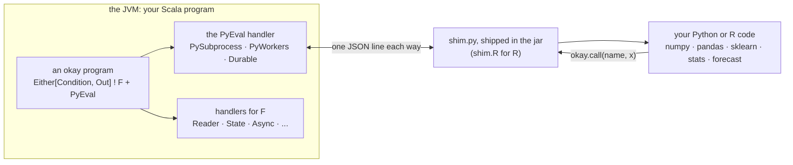
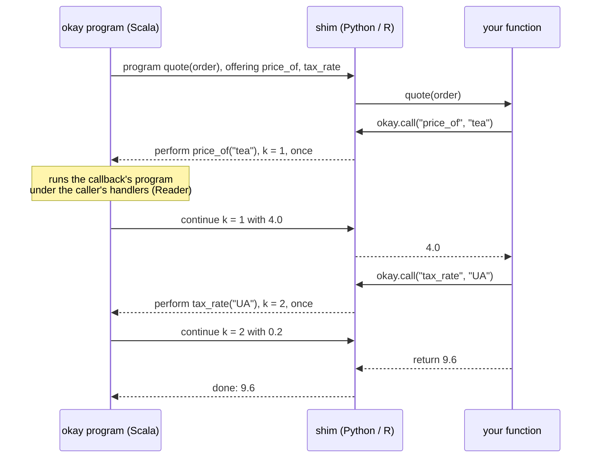

# okay with Python and R

okay is an effects library for Scala 3, with a facade for Scala 2.13. A
program is a value, a tree of operations, and handlers decide what each
operation means. This page shows two languages taking part in such a
program: Python and R. A Scala program calls their functions as TYPED
Scala functions. Their code can in turn call back into okay in the middle
of a call, and the callback runs under the okay program's own handlers:
its Reader, its State, its journal.

Each interpreter runs in its own process: real CPython, real R, every
wheel and every CRAN package, and a crash there never takes the JVM down.
Nothing is lost by that boundary. What can cross it is decided in one
place, and everything below is built on it.

<!-- not-a-test: a diagram -->


## A call, and a call back

A small shop. The price list and the tax rates belong to the Scala
program: they are its configuration, read through okay's `Reader`. The
arithmetic belongs to a Python function, which asks for what it needs
while it runs:

```python
def quote(order):
    price = okay.call("price_of", order["sku"])
    tax = okay.call("tax_rate", order["country"])
    return price * order["qty"] * (1 + tax)
```

On the Scala side, the two names are two small okay programs, and the
Python function becomes a typed Scala function that is offered them:

```scala
val priceOf = Py.callback[String, Double]("price_of")(sku => Reader.ask[Catalog].map(_.prices(sku)))
val taxRate = Py.callback[String, Double]("tax_rate")(country => Reader.ask[Catalog].map(_.taxes(country)))
val quote = shop.fn[Double]("quote").calling(Py.callbacks(priceOf, taxRate))
val answer = Reader.run(catalog)(quote(Order("tea", 2L, "UA"))).runWith
```

`Order` is an ordinary case class. It reaches Python as a `dict`
(`order["sku"]`), and the answer comes back as a `Double`, or as a `Left`
naming what went wrong.

The same shop in R reads the same way, with `okay_call`:

```r
quote <- function(order) {
  price <- okay_call("price_of", order$sku)
  tax <- okay_call("tax_rate", order$country)
  price * order$qty * (1 + tax)
}
```

```scala
val quote = shop.fn[Double]("quote").calling(R.callbacks(priceOf, taxRate))
```

## What is the name in `okay.call("price_of", x)`?

The name is a string that the SCALA side chose. It is the first argument
of `Py.callback`:

```scala
val priceOf = Py.callback[String, Double]("price_of")(sku => Reader.ask[Catalog].map(_.prices(sku)))
```

It is not the name of a Scala method, and it is not the name of anything
in Python. It is a label for one callback, and it is agreed between the
two sides the way a route is agreed between an HTTP client and a server.

**Why a name and not a function.** Python and the JVM are two processes,
and only data crosses the pipe between them. A Scala function cannot be
sent to Python, so it stays in okay and is NAMED. When Python says
`okay.call("price_of", "tea")`, the name travels to okay with the
argument. okay looks the name up among the callbacks it offered, runs
that callback's program, and sends the answer back as the value of
`okay.call`.

**Offered to ONE call.** A call does not see every callback in the
program. `.calling(Py.callbacks(priceOf, taxRate))` sends exactly these
names along with this call, and Python may use only them. The shim keeps
the offered names per active call, so a call started from inside another
call sees its own set. A name that was not offered, typos included, is
refused inside Python, and the refusal lists what was offered:

```scala
assertEquals(refused, Left(Condition("LookupError", "okay_call('prices_of'): this call was offered ['price_of']")))
```

**Arguments and answers are typed at the boundary.** Everything after the
name is the argument: one value is decoded as the callback's input type
(`String` for `price_of`), and several arrive as a list. The callback's
answer is encoded back through its `Schema`. A value of the wrong shape
does not reach the callback at all. Python gets `okay.OkayError` with the
kind `Decode`, and may catch it like any exception. R gets a condition of
class `okay_error`.

**Choosing names.** Pick one name per callback, and keep it stable. It is
the one place where the two codebases have to agree, so write it as a
constant if more than one call uses it. In R the same name is used with
`okay_call`, so one Scala `Callback` can serve both languages.

Under the hood, a call that can call back is a short dialogue, and each
arrow on the Scala side is one okay operation:

<!-- not-a-test: a diagram -->


A callback may even call Python again. While the Python frame waits for
its answer, the shim serves any request that arrives, so the nested call
goes over the same pipe. Because each step is an ordinary okay operation,
`Durable` journals the whole dialogue, and a replay answers every step
from the journal without starting Python.

**One engine, many languages.** `Py` is the Python name of okay's
foreign engine. The same engine is `Foreign`: `Foreign.fn`,
`Foreign.program`, `Foreign.callback`, the effect `ForeignEval`, and the
engine `ForeignWorker` (`speaking`, `connect`, `over`). It carries Haskell,
Go and Rust too, over pipes, TCP and calls into this process
([okay with Go](go.md), [okay with Rust](rust.md)). The Python examples
keep `Py`, which is an alias.

## Programs as data: many answers, and Haskell

A callback's continuation is a Python frame waiting in `okay.call`, so it
can be resumed once. Some code can do more. A program can be written as
DATA, a value built from `okay.done` and `okay.perform(...).then(f)`,
where the rest of the program is an ordinary function:

```python
def pairs():
    return okay.perform("choose", [1, 2]).then(lambda x:
           okay.perform("choose", [10, 20]).then(lambda y:
           okay.done(x + y)))
```

The worker hands okay one node at a time and keeps each continuation
under an id. okay may therefore continue the SAME one twice, and its
`Choice` handler, asked for every combination, gets all four:

```scala
val pairs = Py.program[Long]("progs:pairs").calling(Py.callbacks(choose))()
assertEquals(runChoice(pairs.program).runWith.toList, List(Right(11L), Right(21L), Right(12L), Right(22L)))
```

`pairs.forget` releases the continuations the worker kept, just as
`release` drops a held object.

Haskell is where this shape is at home: its continuations are pure
functions. The jar ships a small Haskell module, `Okay` (base and
containers only), and a program written against it:

```haskell
pairs :: [Value] -> Prog Value
pairs _ = do
  x <- perform "choose" [VList [VInt 1, VInt 2]]
  y <- perform "choose" [VList [VInt 10, VInt 20]]
  return (VInt (asInt x + asInt y))
```

`HaskellWorker.build(dir)` compiles it with GHC, and
`PySubprocess.speaking(Seq(binary))` runs it. The worker speaks the same
wire as Python, so the same `Py.program` drives it, multi-shot included.
A Haskell `error` arrives as a condition by name, and the worker keeps
running. R has it too (`okay_done`, `okay_perform`, `okay_then`, and
`R.program`), with R closures as the continuations. The protocol is
[specs/remote-foreign.md](../specs/remote-foreign.md).

### Haskell programs typed by their effects

`perform "price_of" [sku]` names the operation by a string and answers an
untyped `Value`. GHC checks neither. The jar also ships `OkayEff`, where
an effect is a GADT of its operations, and a program carries the effects
it may perform in its TYPE, as in freer-simple or polysemy. You do not
write the GADT. `Hs.ops` writes it from the Scala callbacks that answer
the operations:

```scala
  val priceOf = Foreign.callback[String, Double]("price_of")(sku => Reader.ask[Map[String, Double]].map(_(sku)))
```

`Hs.ops("Shop", Foreign.callbacks(priceOf, discount))` is a module `Shop` with
`data Shop a where PriceOf :: String -> Shop Double; Discount :: Double -> Shop Double`
and its wire instance. The Haskell program declares `Shop` in its type:

```haskell
total :: String -> Integer -> Eff '[Shop] Double
total sku qty = do
  price <- send (PriceOf sku)
  send (Discount (price * fromInteger qty))
```

- **An undeclared effect.** If `Shop` is left out of the list,
  compilation fails with GHC saying *this program does not declare the
  effect Shop*, not with an obscure missing instance.
- **Wrong types.** `send (PriceOf qty)` fails with a type mismatch, and
  `price` is a `Double` because the Scala callback answers one.
- **Serving it.** `program (total ...)` is an ordinary `Prog Value`, so
  `serve`, the wire, multi-shot continuations and `Durable` are
  unchanged. Untyped programs keep working.

Frege, the Haskell on the JVM, cannot go this far: it has no type-level
lists, so there an operation's answer is typed and the set of operations
is not ([where each language names okay's effects](jvm-languages.md#where-each-language-names-okays-effects)).

## The rest of the toolkit

Each of these has a section with its tests in
[okay-py](modules/okay-py.md) and [okay-r](modules/okay-r.md).

| | what it gives you |
|---|---|
| typed calls | `Py.fn[Out]("module:function")(args)`: case classes cross as dicts or named lists, and sealed traits as dicts with a `"type"` field |
| held objects | `Py.hold(...)`: a fitted model stays in the worker, and its methods are called by name |
| modules beside the Scala | `Py.module("name", """...""")`: a few lines of Python or R in the Scala file, shipped with the jar |
| a generated facade | `runMain okay.py.PyFacade <module> <Object> <package>`: a typed Scala object written from the module's type hints |
| streams | `Py.stage(...)`: a function over a list becomes a stage over chunks, and a slow model holds back its source |
| sources | `Py.source[A]("m:rows")(args)`: a Python generator of chunks (R: a closure answering the next chunk, NULL at the end) read at the consumer's pace — a file, a cursor, a query on the far side |
| a declared environment | `PyEnv(python, packages)` through uv, `REnv(packages)` through CRAN, built once and then cached |
| a journal | `Durable` records every call, and a replay needs no interpreter |

A model held on the Python side, used from Scala:

```scala
val model = scoring.hold("Model")(10L).runWith.toOption.get
assertEquals(model.call[Long]("predict")(5L).runWith, Right(15L))
```

A source the far side owns, read one chunk per call — the next chunk is
asked for only when the consumer has taken the last, so a Scala consumer
that stops after four rows reads two chunks of three, not the whole file
(foreign-one-mux). In R the source is a closure:

```scala
      val out = Writer.run(R.source[Long]("rsources::rows")(10L, 3L)).runWith(using r.handler)._1.toList
```

An R fit held in R, predicted on new data:

```scala
val fit = R.hold("stats::lm")(formula, Data(Vector(1, 2, 3, 4), Vector(3, 5, 7, 9))).runWith.toOption.get
val predicted = R.fn[Vector[Double]]("stats::predict")(fit, NewData(Vector(10.0, 0.0))).runWith
```

## Frames as Arrow

A frame is a table: named columns of one length. By default it crosses
to Python as the wire's JSON, one cell at a time. When the worker's
Python has `pyarrow` installed, the worker says so in its hello. The
frame then crosses as ONE Apache Arrow IPC stream: the columns as
buffers, with the request itself in the stream's metadata. Nothing is
imported, and nothing in the program changes:

```scala
    assertEquals(engine.wire, "json/none+arrow")
```

The Python function is unchanged too. It still receives a dict of lists
and may answer a dict, a pandas frame or a `pyarrow.Table`. A function
that wants the table itself says so, and gets a `pyarrow.Table` with no
conversion at all:

```python
import okay

@okay.arrow
def same(t):
    return t
```

What it buys, measured (`MeasurePyArrow`: three columns, float64, int64
and text, through a real worker):

| rows | JSON | Arrow, a dict in Python | Arrow, `@okay.arrow` | bytes, JSON / Arrow |
|---|---|---|---|---|
| 100 000 | 167 ms | 43 ms | 27 ms | 2.5 / 2.8 MB |
| 500 000 | 806 ms | 147 ms | 89 ms | 13.7 / 14.4 MB |

The bytes are about the same; the time was Python walking the cells one
at a time, and on the JVM side a JSON tree built and walked (65 + 104 ms
for 500 000 rows, against 41 + 23 ms to write and read Arrow).

Two things decide where Arrow applies:
- **Five kinds of column cross as Arrow**: int64, float64, text, bool,
  and a column of None alone. Every one of them may hold None. A frame
  with another column (ints mixed with floats, a big int, bytes, lists,
  dicts, handles) takes the JSON road, as it always did. The answer
  works the same way. Python's other Arrow types are converted to the
  five on the way back (int32 to int64, float32 to float64, dictionary
  columns decoded). Anything else answers as a JSON frame.
- **The choice is a given, like the wire's format.** With no import,
  Arrow is used where the worker speaks it, and nothing is refused
  where it does not. `import FrameFormat.Json.given` never uses Arrow.
  `import FrameFormat.Arrow.given` requires it: a worker without
  pyarrow is refused when it is opened, and a frame Arrow cannot carry
  answers `NotArrow`, naming the column.

The JVM side writes and reads Arrow itself (`OkayArrow`, in
[okay-arrow](modules/okay-arrow.md)), for
exactly those five columns. It does not depend on Arrow Java, which
brings its own off-heap memory and `--add-opens`. pyarrow checks every
stream it writes (`TestArrowPy`, `validate(full=True)`).

**R does the same thing** (`r-arrow`), over R's own four atomic types
(logical, integer, double, character) rather than Python's five — R
has one integer width, so there is no int32-to-int64 widening to do.
The worker announces Arrow when the `arrow` package is installed, and
nothing else changes: an R frame function still receives and answers a
`data.frame`.

```scala
    assertEquals(engine.wire, "json/none+arrow")
```

The same two knobs apply: `FrameFormat.Json.given` never uses it,
`FrameFormat.Arrow.given` requires it (a session without the `arrow`
package is refused when it is opened). A column R cannot carry here —
raw bytes, a nested list, a held object reference — takes the JSON or
CBOR road instead, as it always did; the answer works the same way.

## Types on the other side

okay checks every value against its `Schema` at the boundary, but the
Python code on the other side does not see those types. `Stubs.python`
writes them out as a Python module, from the same `Schema`s:

```scala
val declarations = Stubs.python(summon[Schema[Order]], summon[Schema[Shape]], summon[Schema[Tree]])
```

For a case class `Order`, an enum `Shape` and a recursive `Tree`, it
writes:

<!-- not-a-test: generated output, checked by mypy in TestPyStubs -->
```python
class Order(TypedDict):
    id: int
    lines: list[Line]
    note: Optional[str]
    total: int
    raw: bytes


class Circle(TypedDict):
    type: Literal["Circle"]
    r: float
...
Shape = Union[Circle, Rect]
```

These are `TypedDict`s, the shape a dict has, because a case class
reaches Python AS a dict. A sum becomes a union discriminated by its
`"type"`, which mypy and pyright narrow on. Checked by the real mypy:
what okay sends passes as the declared type, and `o["lines"][0]["quantity"]`
fails before anything runs. The same generator writes a TypeScript
`.d.ts` for values carried by okay's JSON (`Stubs.typescript`, in
okay-codec; `tsc` checks it the same way).

That check found a defect on its first run. A `BigInt` too big for a
`Long` crossed to Python as a `str`, not the int Python has for it, and
now it crosses as an int.

## What stays safe

- **No string is evaluated.** Every call ADDRESSES an existing function
  by name, and no wire operation evaluates source. A module written
  beside the Scala must be a compile-time constant, which `Py.module`
  checks, so untrusted input reaches Python or R only as data.
- **A clean environment.** The interpreter sees exactly the variables the
  configuration names, and nothing else from the JVM's environment.
- **Crash isolation.** A dead worker makes the call in flight THROW, and
  a pool replaces the worker. A Python exception is data, a `Left`, and
  the worker survives it.
- **No drift.** The shim ships in the jar, and a version handshake
  refuses a shim from another release by name.

## The limits, stated

- **One resume per callback.** A callback's continuation is a blocked
  Python or R stack frame, so it can be resumed ONCE. A handler that
  would resume it twice is refused by name, not answered wrongly.
- **Fail with a `Left`.** An exception THROWN out of a callback's program
  (rather than a `Left`) leaves the waiting frame parked. The worker
  stays usable, but that frame never returns.
- **Handles are not durable.** A held object lives in ONE process. A whole
  program replays from its journal, but a recovery that continues live
  on a fresh process meets a handle that process never held, and is
  refused by name.
- **Every crossing is serialised.** By default, values cross as plain
  JSON on a child's pipes, and are compressed only over a network, where
  the far side can decompress it (raw DEFLATE, or zlib for R): on a pipe
  compression costs CPU and saves nothing. An import picks CBOR, or asks
  for compression on a pipe too, for Python and R alike: see
  [the wire's encoding](one-language.md#the-wires-encoding-chosen-by-a-given).
  A frame crosses as Arrow where the worker has pyarrow
  ([frames as Arrow](#frames-as-arrow)). For big frames in R,
  [okay-r](modules/okay-r.md) records what the JSON road costs.

TypeScript speaks the same wire, through the same API: see
[okay with TypeScript](typescript.md).

Why a process at all, and not Python inside the JVM: see
[specs/py.md](../specs/py.md). In short, the value of Python and R is
their C- and Fortran-backed packages, and a JVM reimplementation lags
exactly there. GraalPy, and Jython for Python 2 scripts, are on the
backlog as additional engines behind the same interface.

## Literature

- Gordon Plotkin, Matija Pretnar. *[Handling algebraic effects.](https://doi.org/10.2168/LMCS-9(4:23)2013)* LMCS 2013. A callback is an operation, and the okay side is its handler.
- Ana Lúcia de Moura, Roberto Ierusalimschy. *[Revisiting coroutines.](https://doi.org/10.1145/1462166.1462167)* TOPLAS 2009. The waiting Python frame is an asymmetric coroutine, resumed once.
- Oleg Kiselyov, Hiromi Ishii. *[Freer monads, more extensible effects.](https://doi.org/10.1145/2804302.2804319)* Haskell 2015. The program-as-data shape the dialogue walks.
- Oleg Kiselyov, Amr Sabry, Cameron Swords. *[Extensible effects: an alternative to monad transformers.](https://doi.org/10.1145/2503778.2503791)* Haskell 2013. A program indexed by the effects it may perform, and `Member`: `OkayEff`'s shape.
- Mark Raasveldt, Hannes Mühleisen. *[Don't hold my data hostage: a case for client protocol redesign.](https://doi.org/10.14778/3115404.3115408)* PVLDB 10(10), 2017. Moving a result set cell by cell costs more than computing it; a columnar transfer format is the cure, and frames as Arrow are that cure here.
- Daniel J. Abadi, Samuel R. Madden, Nabil Hachem. *[Column-stores vs. row-stores: how different are they really?](https://doi.org/10.1145/1376616.1376712)* SIGMOD 2008. Why a column is one buffer and not a list of cells.
- Apache Arrow. *[Arrow columnar format](https://arrow.apache.org/docs/format/Columnar.html)* and its IPC streaming format: what okay-arrow writes and reads.
- Martin Fowler. *[Event sourcing.](https://martinfowler.com/eaaDev/EventSourcing.html)* 2005. Why a journal of answers is enough to replay a program.

The whole design, stage by stage, with what was found and refuted on the
way: [specs/foreign-highlevel.md](../specs/foreign-highlevel.md).
