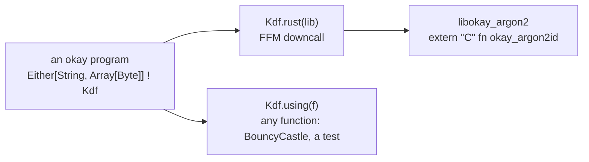

# okay with Rust (and a word on Go)

Rust brings okay COMPUTE: kernels such as hashing, parsing, compression
and SIMD, written once and fast. It does not host okay programs. A Rust
`async` future is not a continuation that okay could resume from
outside, so the effect system stays in Scala, and Rust does the
arithmetic.

A Rust kernel reaches okay as an **effect**, whose operations are the
kernel's calls. A program asks for the operation, and a handler decides
what computes it: the Rust kernel, a JVM implementation, or a test's
stand-in. The program does not change, and the kernel can be swapped per
platform, mocked, and measured.

<!-- not-a-test: a diagram -->


## The first kernel: Argon2id

`okay-rust/kernels/argon2` is a Cargo crate built as a `cdylib` and a
`staticlib`. It has one dependency, the RustCrypto `argon2` crate, and
`Cargo.lock` is checked in, so it builds offline and reproducibly. It
exports one C function:

```rust
#[no_mangle]
pub extern "C" fn okay_argon2id(
    password: *const u8, password_len: usize,
    salt: *const u8, salt_len: usize,
    memory_kib: u32, iterations: u32, parallelism: u32,
    out: *mut u8, out_len: usize,
) -> i32 {
```

The C ABI is kept small on purpose:
- only pointers, lengths and integers cross it;
- the answer is a code: 0 for done, and negative numbers the Scala side
  names;
- **the caller owns every buffer**, including the output, so nothing is
  allocated in Rust and freed in Java. That means no pair of allocators
  to keep matched, and no leak on an early return.

## From Scala: FFM, then an effect

`NativeLib.load(path)` binds the library through FFM, the JDK's foreign
function API (JEP 454, final in JDK 22). There is no JNI glue and no
generated code. `Kdf` is the effect:

```scala
enum Kdf[+A] derives okay.Effect:
  case Argon2id(password: Array[Byte], salt: Array[Byte], memoryKb: Int, iterations: Int,
                parallelism: Int, length: Int) extends Kdf[Either[String, Array[Byte]]]
```

A program is written against the effect and knows nothing of Rust:

```scala
  def stored(password: String, salt: String): Either[String, String] ! Kdf =
    Kdf.argon2id(password.getBytes("UTF-8"), salt.getBytes("UTF-8"), memoryKb = 64, iterations = 2, parallelism = 1)
      .map(_.map(hex))
```

There are two handlers:
- `Kdf.rust(lib)` calls the kernel. Each call allocates its buffers in a
  confined arena, which is freed when the call returns.
- `Kdf.using(f)` answers with any function, for example okay-security's
  BouncyCastle Argon2 or a test's stand-in.

One program, either handler, the same answer:

```scala
    assertEquals(stored("pw", "saltsalt").runWith(using rust), stored("pw", "saltsalt").runWith(using Kdf.using(bouncy)))
```

## How it is held honest

- **The law.** For the same inputs, the Rust kernel's bytes are
  BouncyCastle's bytes. The test covers 48 cases: four parameter sets,
  two salts, an empty and a long password, and three lengths. A mutant
  kernel on Argon2 version 0x10 instead of 0x13 fails it.
- **Refusals are values.** Parameters Argon2 refuses come back as
  `Left("okay_argon2id answered -2: parameters Argon2 refuses")`, not an
  exception. A symbol the library does not export is refused by name when
  it is bound, not at the first call.
- **Native access is declared.** The tests fork with
  `--enable-native-access=ALL-UNNAMED`, which JDK 24+ otherwise warns
  about at the first restricted call. An application does the same, or
  names its module.

The module's floor is JDK 22, because FFM is final there (`jdkFloor(22)`,
[JDK compatibility](../specs/jdk-compatibility.md)). The check needs
`cargo`, so it is tagged `Live`, and the effect's own tests run in the
default gate.

## The same kernel as WebAssembly, under Chicory

The same crate compiles to `wasm32-wasip1`: a 70 KB module run by Chicory,
a WebAssembly runtime written in Java. There is no native code in the
process. The kernel's memory is its own linear memory, so a bug in it
cannot reach the JVM's heap, which makes this the road for UNTRUSTED
plugins.

- **What the module is granted.** `WasmLib.load(bytes)` gives it a WASI
  that grants nothing: no files, no environment, no arguments. Its stderr
  goes to a buffer of its own. When a call TRAPS, the `Left` carries
  what the module wrote there (a Rust or Go panic's reason), not just
  "unreachable". A reactor module's `_initialize` is called once, at
  load.
- **Buffers.** A host cannot hand a module its own pointers, so the crate
  also exports `okay_alloc`/`okay_free`. Buffers live in the module's
  memory, and `withBuffers` frees every one after the call.
- **The handler.** `Kdf.wasm(lib)` is the effect's third handler:

```scala
  private def wasm: Handler[Kdf] = Kdf.wasm(lib)
```

- **The law holds here too.** Under Chicory the kernel gives
  BouncyCastle's bytes over the same 48 cases. They take about 4.5 s,
  because Chicory interprets, against about 1.3 s native. Refused
  parameters give the same `Left`, and a mutant that reads the output one
  byte off fails the law.

Go reaches the same road with `GOOS=wasip1 GOARCH=wasm`
([okay with Go](go.md)).

## What comes next

- **Scala Native.** The same crate's `staticlib`, linked through
  `@extern`: an ordinary C call, with the same law.

## Go

Go is possible, and of the three the least worth doing IN-PROCESS.
`go build -buildmode=c-shared` exports a C ABI, but it loads a second
runtime into the JVM, with its own garbage collector, its own scheduler
and its own signal handlers. Go installs `SA_ONSTACK` handlers that the
JVM also wants, and a cgo call from a foreign thread costs a thread
switch. Most Go code is SERVICES, and a service's seam is the network,
which okay-http already speaks. So okay's roads to Go are:

1. a worker process on okay's wire, the way the TypeScript and Haskell
   workers run. This one is built: [okay with Go](go.md);
2. a Go plugin compiled to WebAssembly (`GOOS=wasip1`, no TinyGo needed),
   on the Chicory road above.

In-process `c-shared` is refused for the reasons above.

## Literature

- [JEP 454: Foreign Function & Memory API](https://openjdk.org/jeps/454), final in JDK 22.
- A. Biryukov, D. Dinu, D. Khovratovich, S. Josefsson. [RFC 9106: Argon2 Memory-Hard Function for Password Hashing and Proof-of-Work Applications](https://doi.org/10.17487/RFC9106), 2021.
- The [RustCrypto `argon2` crate](https://docs.rs/argon2/0.5.3), the kernel's implementation.
- Gordon Plotkin, Matija Pretnar. [Handling algebraic effects](https://doi.org/10.2168/LMCS-9(4:23)2013), LMCS 2013: why a kernel is an operation and its implementation a handler.

The design and its results: [specs/polyglot-rust.md](../specs/polyglot-rust.md).
