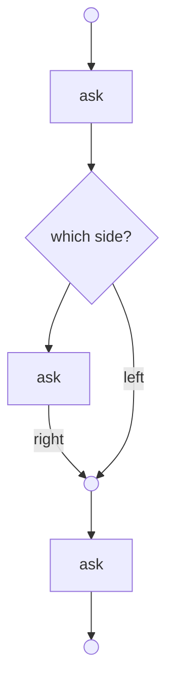

# Static workflows: the same program, as a term you can read

A durable workflow here is ordinarily a **monadic** program — you
write it with `direct`, it runs on `Dialogue.workflow`, and where it
stands is re-derived by replaying it over its journal
([durable workflows](durable-workflows.md)). That is the right default
and it is not going anywhere.

This page is about the other half: the same workflow written as a
**term**, so that its shape is a value you can walk before you run it.

> Every block on this page is a test. The terms and the block are
> `src/test/scala/TestProc.scala` and `TestProcDirect.scala`; the
> journal-sharing ones are `okay-persist`'s `TestWorkflowProc`.

## Why a second shape exists at all

The design record for the monadic engine ends on a sentence worth
repeating, because it is what this shape is for:

> Past a `Bind`, walking **is** running.

A monadic program's continuation is a host closure. You cannot ask it
what it will do next without doing it — so "which questions may this
run ask", "would this deploy strand it", "draw me where it is" are all
questions that can only be answered by starting it.

A term has no closure in its spine, so all three become ordinary
folds:

| question | monadic | as a term |
|---|---|---|
| what may it ask? | run it | `leaves` |
| where does it stand? | replay it | `walk`, which performs nothing |
| would this deploy strand it? | find out in production | `accepts(journal)`, before the deploy |
| draw it | a status projection a worker keeps in step | `render` |

## The block

The straight-line spelling is the same one the monadic workflow uses,
and it compiles to the term:

```scala
val booking: Wf.Proc[String, String, Unit, String] =
  Proc.direct: _ =>
    val city = !ask("city?")
    val t    = !now
    val id   = !uuid
    s"$city/$t/$id"
```

**No type arguments.** The expected type on the `val` — or on a
`def`'s result — carries the signature, the input and the answer, and
the block's parameter type comes with them. `Proc.direct[Sig, X, Y]`
is available and is what you write where there is no expected type;
everywhere else it is noise. That holds for branches and loops too.

**And no marks either, if you want.** With
`import okay.Proc.given` (and `scala.language.implicitConversions`) a
question reads as its answer:

```scala
val booking: Wf.Proc[String, String, Unit, String] =
  Proc.direct: _ =>
    val city: String = ask("city?")
    val t: Long      = now
    s"$city/$t"
```

The conversion requires a capability that exists only inside a block,
so outside one a question is not a value — and without the import
nothing changes at all, which is why a file that did not ask for
colouring cannot get it by accident. The two spellings mix freely.

**One trap, and it is a compile error rather than a surprise.** The
conversion fires where an ANSWER is expected, and `"a" + q` expects
nothing in particular — `String.+` takes `Any`. So a question there
would be quietly stringified; the macro refuses instead:

```
Proc.direct: this question is never asked — it stands where ANY value
is accepted ("a" + q, an interpolation, a println), so nothing asked
for its answer. Mark it (!q), or ascribe what you want.
```

That was measured before the check existed:
`ask("left?") + "|" + ask("right?")` answered `l|Ask(right?)` and
asked one question.

Beside its monadic twin, which asks the same three questions:

```scala
def bookingMonadic(using w: Wf.Asks[String, String, String, Pure]): String ! (Delim + Pure) =
  direct:
    val city = !w.pause("city?")
    val t    = !w.now
    val id   = !w.uuid
    s"$city/$t/$id"
```

**They write the same journal, record for record**, and that is
asserted rather than hoped: a run started by one is carried to the end
by the other over one topic. Pick a shape per program, not per system.

What `!` marks here is an **operation** — a question of the signature
— never a `Proc`. That distinction is the whole of what makes the
spine static, and the macro refuses the other case by name:

```
Proc.direct: this mark's value is a Proc, so the STEP is chosen by a
value this block binds — that is `app`, and an arrow with `app` is a
monad (Hughes 2000, §4.5).
```

## What you get for it

```scala
booking.leaves.map(_.name)        // Vector("ask", "now", "uuid")
```

Before anything runs, and the names are **the author's own**: the leaf
is named after the door the block called, so a term reads in the
vocabulary of the program rather than of the library.

```scala
Wf.Proc.walk(booking)((), journal)
// Right(Standing.Done("Kyiv/1700000000000/id-1"))
// Right(Standing.Asking(path, Question.Uuid(), accepted = 2))
// Left(Stranded(path, record = 1, "Now() cannot take Right(Kyiv)"))
```

`walk` has **no runtime, no row and no monad in its signature**, which
is the proof it performs nothing — the same way `Wf.replay` taking no
`Runtime` is the proof it cannot read a clock. It is what lets a
deploy ask ten thousand live runs whether they still fit the new code
without starting one of them.

And a journal that does not fit is **data**, not an exception: the
path says where, the record number says which, and the question says
what it could not take.

## Two readings of one position, and they must agree

This is the property the whole shape rests on:

```
walk(term)(x, journal)   ==   Wf.replay(program(term)(x))(journal)
```

`walk` is what the deploy check and the picture trust; `replay` is
what the engine trusts. They are asserted equal on **every prefix** of
several journals, including one written before a `patch` existed. A
disagreement is a bug found before a journal is.

It has been watched failing, which is the half that makes it evidence.
Breaking the fold three ways:

| break | what goes red |
|---|---|
| the loop stops counting its rounds | the position test, printing the path it got |
| a leaf reads an answer without consuming it | six tests, both agreement properties among them |
| a patch eats the record after it | the old-journal pair |

## Branches

An `if` whose branches ask questions is part of the term, both sides
of it:

```scala
val districted: Wf.Proc[String, String, Unit, String] = Proc.direct: _ =>
  val city = !ask("city?")
  if city == "Kyiv" then
    val d = !ask("which district?")
    s"$city/$d"
  else s"$city/whole"

districted.leaves.map(_.name)   // Vector("ask", "ask") — BOTH branches
```

`leaves` reports both because which side runs is decided by a value
that does not exist yet; a run asks only the taken one. That
over-approximation is the whole point — a capability list, a dry run
and a deploy check all want the upper bound.

The condition may be a question too (`if !patch("promo") then …`),
and an `if` over values already bound is ordinary code inside an
`Arr`, costing no node.

**Top-level only**: a val's right-hand side, a statement of its own,
or the block's answer. An `if` nested inside a larger expression is
refused, and the message says why — it would have to hoist, and a
hoisted mark RUNS whether or not its branch is taken.

## Loops, and the one node the literature lacks

The classic objection to a static workflow is that its shape cannot
depend on an answer. That objection is about `Selective`, whose
`whileS` is a recursive *definition* — an infinite term. **Elgot
iteration is a node**, so the shape stays finite:

```scala
val rooms: Wf.Proc[String, String, Unit, List[String]] = Proc.direct: _ =>
  val n = !ask("nights?")
  var got = List.empty[String]
  while got.length < n.toInt do
    got = got :+ !ask(s"room ${got.length + 1}?")
  got
```

Ask how many nights, then one question per night — in a term whose
`leaves` are two, because the body is counted once.

**Nothing mutates.** An assignment compiles to a rebuild of the
environment with one slot replaced, so the value that goes round the
loop travels on the arrow's edge. That is why a replay re-derives it
exactly, and why the position inside a loop is a path with a counter:

```scala
Wf.Proc.walk(rooms)((), List(Right("3"), Right("a"), Right("b")))
// Asking(at = ".../round2/...", Question.Ask("room 3?"), accepted = 3)
```

`Iter` is not `ArrowLoop` — Paterson's `loop` is lazy *value* feedback
and cannot say "run the body again".

## Two waits at once

A workflow that needs finance and legal to approve something asks
finance, waits a week, asks legal, waits another. The two approvals
have nothing to do with each other — the calendar is what the
sequencing costs, and it is the expensive half.

`Proc.par` puts the two branches side by side over the same input:

```scala
val approvals: Wf.Proc[String, String, Unit, (String, String)] =
  Proc.par(Wf.Proc.ask[String, String, Unit](_ => "finance?"),
           Wf.Proc.ask[String, String, Unit](_ => "legal?"))
```

Both questions are now known before either is answered, so the run's
position is a **pair of paths**:

```scala
Wf.Proc.walk(approvals)((), Nil)
// Waiting(Vector((par0, Ask("finance?")), (par1, Ask("legal?"))), accepted = 0)
```

A front end reads that and puts both questions out on the same
morning. `Standing.pending` reads it and an ordinary `Asking` alike,
so a caller that only wants "what is this run waiting on" need not
know which it has.

**What is parallel is the waiting, not the journal.** A record says
nothing about which question it answers — the engine matches records
positionally — so the answers are still recorded in term order, left
then right. Once finance answers, the run is an ordinary wait on
legal:

```scala
Wf.Proc.walk(approvals)((), List(Right("yes")))
// Asking(par1, Ask("legal?"), accepted = 1)
```

The consequence, so nobody meets it in production: an answer **cannot
be committed out of order**. If legal replies first, the front end
holds that answer until finance's arrives. Committing it early would need
a record that says which branch it belongs to, which is a second
journal format — and this whole design is built on there being one.

`Par` is a node and not `&&&` for exactly this reason: an arrow's
fanout is derivable from `first` and `compose`, and what it derives is
plumbing that walks as **one** position. The node exists so the
position can be a pair.

## Taking it back

A booking that reserves, then charges, then fails at the third step
has to release the reservation and refund the charge — in that order,
newest first. `okay.persist.Saga` does exactly that for a **linear**
sequence of steps, with a journal of its own. A term can do it for a
**shape**, on the workflow's own journal:

```scala
def step(q: String, undo: String): Wf.Proc[String, String, Unit, String] =
  Proc.undoable(Wf.Proc.ask[String, String, Unit](_ => q))(
    Wf.Proc.ask[String, String, (Unit, String)](p => s"$undo ${p._2}") >>> A.arr(_ => ()))
```

`undoable(step)(undo)` is a step with its inverse beside it, and the
inverse is given **both** what the step was handed and what it
produced — usually the second (the charge id to refund), sometimes the
first. Nothing runs it on the way past: under `foldMap` an `Undo` *is*
its step.

When the author decides a run has failed, they ask what it would take
to undo:

```scala
Wf.Proc.compensating(booking)((), journal)
// a Wf.Proc[String, String, Unit, Unit]
```

What comes back is **a term** — an ordinary workflow. It runs on the
same engine, writes to the same journal, draws itself, and resumes
from its own position if the compensation is itself interrupted
halfway. The pieces are in reverse: the last thing done is the first
thing undone.

It works over shapes a `Vector[Step]` cannot express, because the walk
goes through the nodes:

```scala
// one room per night, where the number of nights is an ANSWER
val nights = Proc.iter(Proc.alongside(bookRoom) >>> A.arr(decide))

Wf.Proc.compensating(nights)(Nil, List(Right("a"), Right("b"), Right("c")))
// asks: cancel c, cancel b, cancel a
```

A branch not taken leaves nothing to undo; two rounds of a loop leave
two cancellations, not three.

**Failure is not a new node.** A term that can fail threads
`Either[E, ·]`, and `OnRight` already passes a `Left` through
untouched — so a failure short-circuits the rest by the ordinary
choice. Whether that is a reason to compensate is the author's
decision, and `compensating` is what they call once they have made
it.

**The undos are found, not carried.** The obvious design puts a stack
of compensations on the arrow's edge, to be run when something breaks
— and a computation carried as a value and later run is `ArrowApply`,
which is a monad, which is the one thing this type refuses. Because a
term is walkable, the compensation for a step is simply *there*, at
the path where the step ran.

## The picture

A term draws itself, and the drawing cannot disagree with the program
because it IS the program:

```scala
booking.mermaid()                 // the shape
booking.mermaid(Some(at))         // ...with a run's position marked
```



Both sides of a choice are there, because which one runs is decided by
a value that does not exist yet. A loop is drawn ONCE with a back
edge, for the same reason: how often its body runs is not a fact the
term has, and a picture that unrolled it would be inventing a number.
Pure steps are not drawn — an `Arr` performs nothing.

**The position comes from `walk`**, so a dashboard marks where a run
stands without replaying it or consulting a projection somebody has to
keep in step.

## Optics on a step

An optic is a function polymorphic in a profunctor, constrained by
what it needs — a lens asks for `Strong`, a prism for `Choice` — and a
`Proc` has both. So a step written against the PART of the state it
cares about drops into a term whose edge carries the whole, with no
new machinery:

```scala
val confirmCity: Wf.Proc[String, String, String, String] =
  Proc.direct: c =>
    val answer: String = ask(s"is $c right?")
    answer

val step: Wf.Proc[String, String, Booking, Booking] =
  guest.andThen(city)(confirmCity)     // Booking ~> Booking
```

The journal holds `List(Right("Lviv"))` — the step's answer and
nothing about the booking around it — and the term folds that journal
back to the whole. A prism does the same for one variant of a sum and
asks nothing for the others, while `leaves` still reports its step,
because which variant arrives is decided at run time.

## What it does not do, stated

- **A `for` or a `foreach` over a collection** is a lambda, and a
  question under a lambda is the corner `direct`'s v1 refuses too.
  Write the loop as a `while` over values the block binds; the
  refusal says exactly that.
- **A question in a `while` condition.** The test would have to ask
  once per round inside the loop — expressible, not wired.
- **An `if` nested inside a larger expression**, for the hoisting
  reason above. Bind it to a val first.
- **A mark is still required.** `direct` has auto-colouring behind a
  capability; this road has none, so an operation used where a value
  is wanted is the ordinary type error it should be.
- **The environment is not pruned.** Every bound name rides on the
  edge until the end of the block, as a left-nested tuple. A liveness
  pass would drop the dead ones; nothing has asked for it, and the
  cost is tuple allocation between leaves that are outside calls.

## Which shape to pick

**A term** when the program's shape is fixed — a booking, an
onboarding, a settlement with a known set of steps — and when any of
these matters: knowing the questions in advance, checking a deploy
against live runs, drawing the process, or an exhaustive crash test
(a finite set of leaves means "crash before and after every one of
them" is a property, not a sample).

**A monadic program** when the shape genuinely depends on the answers
beyond a loop — "read the next workflow's name from an answer and run
it" — or when the straight-line code is the point and nothing above is
wanted. Replay is cheap; the design record measured 40 steps for 40
answers.

**They compose one way.** A term becomes a program (`Wf.Proc.program`)
and can be an activity of a monadic workflow; a monadic program can
answer a term's question as an activity. There is one journal format,
one envelope and one worker underneath.

## The algebra, for the curious

`Proc[F, X, Y]` is the **free arrow** over a signature — `Static`'s
neighbour one rung up Lindley, Wadler and Yallop's ladder (*idioms are
oblivious, arrows are meticulous, monads are promiscuous*):

| rung | type here | what it can do |
|---|---|---|
| applicative | `Static[F, A]` | effects fixed before the run, no input |
| **arrow** | **`Proc[F, X, Y]`** | a step may look at what came before it |
| arrow + `app` | a monad | a step may BE what came before it |

The line is `ArrowApply`: Hughes (2000, §4.5) proves an arrow with
`app : P[(P[A, B], A), B]` is exactly a monad, and `Free.Bind`'s
`f: A => Free[F, B]` is `app` spelled as a closure. So the rule for
the spine is not "no monads" but **no operation that takes a
computation as data** — inside a leaf a monad is welcome and is the
point, since an activity runs whatever it likes between two journal
records.

The instance is `Optic.Arrow & Optic.Choice`, so every optic in the
library applies to a step with no new machinery, and the laws are the
shared suite `okay.laws.ArrowLaws` — fifteen of them, instantiated in
three lines, the same suite `Mealy` uses.

---

The design records: [specs/static-workflow.md](../specs/static-workflow.md)
(the shape and what it buys), [specs/proc-notation.md](../specs/proc-notation.md)
(the notation and its translations), [specs/arrows-plan.md](../specs/arrows-plan.md)
(how these lanes were ordered and what each one tested).
