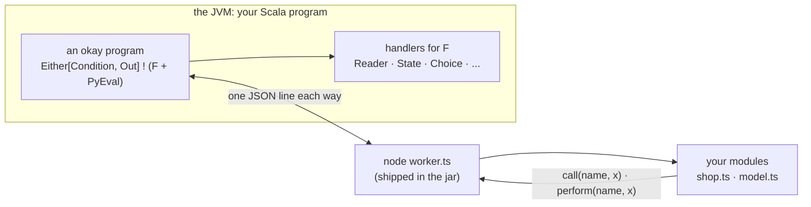

# okay with TypeScript

okay is an effects library for Scala 3. A program is a value, and
handlers decide what its operations mean. This page shows TypeScript
taking part in such a program. A Scala program calls TypeScript functions
as typed Scala functions. The TypeScript code calls back into okay's
effects in the middle of a call. And a TypeScript program can be written
as DATA, whose continuations okay may resume more than once.

TypeScript runs in its own Node process, which speaks okay's line
protocol: the same wire, and the same Scala API, as
[okay with Python and R](python-and-r.md). Node runs `.ts` files by
stripping their types, so there is no build step.

<!-- not-a-test: a diagram -->


## One set of types, three ways to run

Scala and TypeScript meet in three places:

| | Scala | TypeScript | a value crosses as |
|---|---|---|---|
| a Scala backend, a TypeScript frontend | the JVM | the browser | HTTP or WebSocket JSON |
| both in the browser | Scala.js | the browser | a JavaScript value, in-process |
| both on the backend | the JVM | a Node worker | the okay wire |

In all three, a value looks THE SAME to TypeScript: the shape okay's JSON
codec writes. A case class is an object, an enum case is
`{ "Case": {...} }`, `None` is `null`, and a `BigInt` is a string of
digits. So one declaration file, generated once from the Scala types,
types a TypeScript module in all three places:

```scala
def declarations: String = Stubs.typescript(summon[Schema[Order]], summon[Schema[Totals]], summon[Schema[Shape]])
```

A module typed only by it:

```typescript
export function area(s: Shape): number {
return "Rect" in s ? s.Rect.w * s.Rect.h : 3 * s.Circle.r * s.Circle.r;
}
```

On the JVM, `Ts` is the API that speaks this shape to a worker. It is
okay-py's `Py`, with the JSON codec as its shape:

```scala
val total = Ts.fn[Totals]("shop:total").calling(Ts.callbacks(priceOf))(Order("tea", 3L, None))
```

The test checks the claim literally. What the worker receives is
byte-for-byte the JSON an okay HTTP endpoint sends for the same value.
`tsc --strict` compiles the module above, and it refuses `s.Rect.width`.

This page's older examples use `Py.*` with `Stubs.typescriptWire`, the
worker's own wire shape (a sum carries a `type` field). Prefer `Ts` and
`Stubs.typescript`: one shape everywhere.

**Regenerated by the build.** The declarations belong in the frontend's
tree and are regenerated rather than edited. `StubFiles.typescript`
writes them, and rewrites the file only when its text changed, so an
unchanged model does not wake the frontend's watcher. A small `main`
lists the types:

<!-- not-a-test: an sbt setting, shown for the build it belongs in; StubFiles is tested in TestStubFiles -->
```scala
object WriteTypes:
  def main(args: Array[String]): Unit =
    StubFiles.typescript(Paths.get(args(0)), summon[Schema[Order]], summon[Schema[Shape]]): Unit

lazy val tsTypes = taskKey[Unit]("regenerate the frontend's types")
tsTypes := (Compile / runMain).toTask(" my.app.WriteTypes ../frontend/src/model.ts").value
```

`StubFiles.python` does the same for a Python worker's `TypedDict`s.

### Types written in TypeScript first

The other direction works too. A TypeScript developer writes the model:

```typescript
export interface User {
id: number;
name: string;
email?: string;
tags: string[];
}

export type Event = { Joined: Joined } | { Left: Left };
```

`TsTypes.scala(source, pkg)` reads it and writes the Scala: `User`
becomes a `final case class ... derives Schema`, with `email` as an
`Option[String] = None`, and `Event` becomes an `enum` with cases
`Joined` and `Left`.

It reads the declaration subset that describes DATA:
- interfaces;
- a union of `{ Case: Case }` (the shape okay's JSON gives a sum);
- `T[]`;
- `T | null`;
- optional fields.

Anything else is refused by name and line, never guessed: generics,
intersections, methods, maps, and string-literal unions (whose JSON
shape is not a Scala enum's).

**The round trip is exact.** `Stubs.typescript` names the Scala leaves
TypeScript would otherwise collapse: `Int`, `Long`, `Char`,
`BigIntDigits` and `Base64`, declared as `export type Long = number`,
and so on. TypeScript still sees plain numbers and strings, and reading
the declarations back gives the same Scala types. The test goes Scala to
TypeScript to Scala and gets the original types. That Scala is a golden
file which compiles, and its own TypeScript equals the first TypeScript
byte for byte.

### Two copies, kept honest

Some teams keep a hand-written TypeScript model beside the Scala one, or
edit a generated file after checking it in. `TsCheck` asks `tsc` whether
the two are still the same types. For every type, a line compiles only
when each copy is assignable to the other, so field order and formatting
don't matter, but a field or its optionality does:

```scala
assertEquals(TsCheck.same(generated, handwritten), Right(()))
```

A renamed field, a field made optional, or a missing type comes back as
`Left`, naming the type (`"Line: …"`), in time to fail a build rather
than reach a user. `TsCheck.sameAs(file, schemas*)` compares a file
against the declarations the Scala types generate
([specs/typescript-types.md](../specs/typescript-types.md)).

## A Scala backend, a TypeScript frontend: the typed client

The routes of an okay-http server are already typed. Each route knows
its path parameters, its query, the `Schema` it decodes a body with, and
the `Schema` it encodes the answer with:

```scala
.out[Int *: EmptyTuple, Task](Method.Get, byId)(id => pure(store.get(id)))
.jsonOut[EmptyTuple, NewTask, Task](Method.Post, board, status = 201) { (_, t) =>
```

`TsClient.model(router)` writes the types (`model.ts`), and
`TsClient.client(router)` writes one async function per route
(`client.ts`). The frontend then calls the backend as ordinary typed
functions:

```typescript
const made: Task = await postTasks(o, { title: "write the docs", tags: ["docs"] });
const again: Task = await getTasksById(o, made.id);
const docs: Task[] = await getTagged(o, { tag: ["docs"] });
```

- **Naming.** A function's name comes from the method and the path:
  `GET /tasks/{id}` is `getTasksById`.
- **Parameters.** The path's parameters, the body and the query are the
  function's parameters.
- **Answers.** The answer's type is the `Schema` the router ENCODES
  with, so the client cannot promise what the server does not send. A
  route that answers a page or a stream answers the `Response`.
- **Errors.** A non-2xx answer throws `OkayHttpError` with its status
  and body.

The test runs a real okay-http server and a Node program calling it
through the generated client. `tsc --strict` compiles that program and
refuses `t.name` where `Task` has no `name`. A renamed Scala field is
caught when the frontend compiles, not when a user clicks.

## A module

```typescript
import { call, done, perform, then, type Prog } from "./okay.ts";
import type { Order, Shape, Totals } from "./model.ts";

export function total(order: Order): Totals {
  const price = call<number>("price_of", order.sku);
  return { sku: order.sku, amount: price * Number(order.qty), note: null };
}
```

- **`./okay.ts`** is okay's TypeScript library. It ships in the jar, and
  `TsWorker.start` writes it beside your modules.
- **`call("price_of", sku)`** calls back into okay. It runs the callback
  the Scala side offered under that name, as an okay program under the
  caller's handlers, and returns its answer.
- **`./model.ts`** holds the types of the values, generated from the Scala
  `Schema`s:

```scala
val model = Stubs.typescriptWire(summon[Schema[Order]], summon[Schema[Totals]], summon[Schema[Shape]])
```

## From Scala

```scala
private lazy val w = TsWorker.start(dir, modules = Seq("shop"))
```

```scala
val priceOf = Py.callback[String, Double]("price_of")(sku => Reader.ask[Map[String, Double]].map(_(sku)))
val total = Py.fn[Totals]("shop:total").calling(Py.callbacks(priceOf))(Order("tea", 3L))
assertEquals(Reader.run(Map("tea" -> 4.0))(total).runWith, Right(Totals("tea", 12.0, None)))
```

The API is okay-py's, because the wire is. `Py.fn` makes a typed call,
`Py.callback` offers a callback, `Py.hold` keeps an object in the worker,
`Py.program` runs a program as data, and `Durable` journals any of them.
What the name in `call("price_of", ...)` is, and why a callback is a
name rather than a function, is explained in
[okay with Python and R](python-and-r.md#what-is-the-name-in-okaycallprice_of-x).

## A typed Scala facade for a TypeScript module

Addresses like `"shop:total"` and hand-written type arguments work, but
the TypeScript module already declares its types. `TsFacade` reads them
and writes the Scala side, much as `PyFacade` does for Python. The types
come from the compiler: `TsFacade.declarations` runs
`tsc --declaration --emitDeclarationOnly`. So a function whose answer
type was left to inference gets the type tsc inferred:

```typescript
export async function receipt(items: string[], each: number) {
  const r: Receipt = { lines: items, total: items.length * each, note: null };
  return r;
}
```

`TsFacade.render` turns those declarations into Scala:

- the module's own types become case classes and enums (the same
  reading as "Types written in TypeScript first");
- each exported function becomes one method, which calls the worker
  through `Ts.fn`:

```scala
  def receipt(items: Vector[String], each: Double): Either[Condition, Receipt] ! PyEval =
    Ts.fn[Receipt]("facadets:receipt")(items, each)
```

- **Promises.** `Promise<T>` answers `T`, because the worker awaits it.
- **Open types.** `unknown`, `any` and `void` become type parameters:

```scala
  def echo[Out: Schema, A1: ToPy](x: A1): Either[Condition, Out] ! PyEval =
```

- **Optional parameters.** An optional parameter is left out, and the
  method's comment says so.
- **What it cannot type.** A generic, a callback parameter, a `Prog<T>`
  or a `const` gets no guessed method. It gets a comment saying why:

```scala
  // twice: not generated — line 12: a function type is not data
```

- **Imported types.** A type the module imports from `model.ts` (usually
  written from Scala with `Stubs.typescript`) is assumed to be in scope.
  Pass the Scala import that puts it there.

The whole loop:

1. Write the types once in Scala.
2. Generate `model.ts` with `Stubs.typescript`.
3. Write the TypeScript module against `model.ts`.
4. Generate the facade with `TsFacade`.

The test compares a checked-in facade with what the generator writes
today, so a changed signature in the TypeScript module shows up as a
diff in the Scala facade:

```scala
    assertEquals(FacadeTs.receipt(Vector("a", "b"), 2.5).runWith, Right(Receipt(Vector("a", "b"), 5.0, None)))
```

## Programs as data, many answers

```typescript
export function pairs(): Prog<number> {
  return then(perform<number>("choose", [1, 2]), (x) =>
    then(perform<number>("choose", [10, 20]), (y) => done(x + y)));
}
```

The worker keeps each continuation under an id, so okay's `Choice`
handler can continue the same one twice and gets every combination:

```scala
assertEquals(runChoice(pairs.program).runWith.toList, List(Right(11L), Right(21L), Right(12L), Right(22L)))
```

## Objects, async, errors, numbers

- **Held objects.** `Py.hold("shop:counter")()` keeps a `Counter` in the
  worker, and its methods and fields are reached by name.
- **Async functions.** An async function (a `Promise`) is awaited.
- **Errors.** An exception is a condition by name, and the worker lives
  on:

  ```scala
  assertEquals(Py.fn[Long]("shop:fail")().runWith, Left(Condition("RangeError", "typescript says no")))
  ```

- **Numbers.** An integer past 2^53 crosses as a `bigint`, so its declared
  type is `number | bigint`. Bytes cross as a `Uint8Array`, and NaN stays
  NaN.

## Types, checked by the real compiler

`Stubs.typescriptWire` declares the shapes TypeScript actually receives:
a sealed trait or enum is its case's object with `type: "Case"`, and
`None` is `null`. The test compiles the module above with
`tsc --strict`. It passes, and a read of `order.skuu` fails before
anything runs.

(`Stubs.typescript`, without `Wire`, declares what okay's JSON codec
writes instead, `{ "Case": {...} }`, for an HTTP API or a Scala.js
export. The two differ because the codecs do.)

## Inside okay, in the browser: no process at all

In a browser there is no worker to start, and none is needed. okay itself
runs there through Scala.js, and module `okay-ts` walks a TypeScript
program in the SAME JavaScript runtime. The program is the same
`done`/`perform`/`then` objects. Here it is as the JavaScript TypeScript
compiles to:

```javascript
pairs: () => then(perform("choose", [1, 2]), (x) =>
then(perform("choose", [10, 20]), (y) => done(x + y))),
```

```scala
val answers = !.run(runChoice(Ts.run[Choose, Long](programs.pairs(), Ts.callbacks(choose))))
```

The continuations are plain JavaScript functions, so okay's `Choice`
continues one twice here as well, and gets all four answers. A named
operation is an okay callback run under the caller's handlers:

```scala
val priceOf = Ts.callback[String, Double]("price_of")(sku => Reader.ask[Map[String, Double]].map(_(sku)))
```

In-process, values cross the way okay's JSON codec writes them, so their
types are `Stubs.typescript`'s: a sum is `{ "Rect": { w, h } }`. A
JavaScript exception is a `Left(Failure(name, message))`.

## okay, called from TypeScript

The other direction: `Ts.promise(program)` runs an okay `A ! Async` and
hands TypeScript a `Promise` of its value. An `@JSExportTopLevel`
function returning it is an okay program a TypeScript caller simply
`await`s, and its type is again `Stubs.typescript`'s:

```scala
val program = okay.pure[Async, Totals](Totals("tea", 12.0, None))
```

### A module of functions, with its declaration

For more than one function, give each a name with `Ts.expose` and group
them with `Ts.module`. The declaration TypeScript compiles against is
generated from the same Schemas that encode the values:

```scala
  val shop = Ts.module("shop")(
    Ts.expose[Order, Totals]("total")(o =>
      pure[Async, Totals](Totals(o.sku, prices.getOrElse(o.sku, 0.0) * o.qty, None))),
    Ts.expose[Vector[String], Int]("count")(skus => pure[Async, Int](skus.size)),
  )
```

`shop.js` is the object to export (`@JSExportTopLevel("shop")`), and
`shop.declaration` is the file to save as its `.d.ts`. That file holds the
types, then one signature per function:

```typescript
export declare const shop: {
  total(input: Order): Promise<Totals>;
  count(input: string[]): Promise<Int>;
};
```

A TypeScript caller then writes ordinary typed code:

```typescript
const t: Totals = await shop.total({ sku: "tea", qty: 4 });
```

- **A wrong argument.** The promise is rejected with a `TypeError` that
  names the function (`total: ...`).
- **Checked by tsc.** The test compiles a caller with `tsc --strict`
  against the generated declaration. A field the Scala type does not
  have (`t.price`) is refused.
- **Why `expose` and not `export`.** `export` is a reserved word in
  Scala 3.

## Scala code as TypeScript: `Direct.ts { }`

The sections above generate TypeScript TYPES from Scala. okay-js also
turns a small closed subset of Scala CODE into JavaScript. `Direct.ts`
does the same, and adds to each variable and function parameter the type
the Scala compiler inferred:

```scala
    val p = Direct.ts {
      val n = 1
      val s = "a"
      val b = n > 0
      val d = global.document.body
      val f = (x: Int, y: String) => global.console.log(y + x)
      global.console.log(b, d, f(n, s))
    }
```

`Js.printTs(p)` is:

```typescript
var n: number = 1;
var s: string = "a";
var b: boolean = n > 0;
var d: any = document.body;
var f: (a0: number, a1: string) => void = function (x: number, y: string) {
  console.log(y + x);
};
console.log(b, d, f(n, s));
```

A `Dyn` is `any`, because it is untyped JavaScript. A type outside the
subset's short list is refused by name. The subset and its limits are in
[okay-js](modules/okay-js.md).

## okay on npm: `@okay/ts`

A TypeScript project should be able to install okay rather than build
Scala.js. `okay-ts-npm` is okay-ts, okay-crdt and okay's channels
compiled into one ES module. `sbt okayTsNpmJS/npmPackage` writes the
package directory: the module, its `package.json`, and an `index.d.ts`
that the module writes of itself, from the same Schemas that encode its
values.

```typescript
import { gcounter, orset, run, then, performing, done, channel, type GCounter } from "@okay/ts";

const a: GCounter = gcounter.inc(gcounter.empty(), "phone", 2);
const b: GCounter = gcounter.inc(gcounter.empty(), "laptop");
const total: number = gcounter.value(gcounter.merge(a, b));
```

- **CRDT replicas.** `gcounter`, `pncounter` and `orset` are plain JSON
  states with a `merge`. Two replicas changed apart, even offline, merge
  to the same state in any order. The laws are okay-crdt's and are
  tested there.
- **Programs.** `run` walks a program written with `then`, `performing`
  and `done`. Each operation is one of your callbacks, and a callback may
  be `async`:

```typescript
const quote = await run(
  then(performing<number>("price", "tea"), (price) =>
    then(performing<number>("stock", "tea"), (stock) => done({ price, stock }))),
  { price: (sku: string) => (sku === "tea" ? 4.5 : 0), stock: async () => 12 },
);
```

- **Channels.** An okay channel is an `AsyncIterable`:

```typescript
for await (const u of updates) seen.push(u);
```

`scripts/ts-npm-check.sh` is the check, and it does what a user does:
1. `npm pack`;
2. an offline `npm install` of the tarball into a fresh project;
3. `tsc --strict` on this consumer, and on a wrong one, which must be
   refused;
4. Node running the consumer, with its output compared.

**Limits.**
- The package is built, not published: the npm registry is an outward
  step for the owner to take.
- The state types in `index.d.ts` come from Scala Schemas. The function
  signatures are written beside the exports, in the same file, and it is
  the check above (tsc on the real module) that holds the two together.

## Durable flows in the browser

A checkout, a sign-up wizard, a multi-step form: flows whose steps have
effects (reserve the item, charge the card) and which a reload must not
restart from the beginning. `durable` is `run` with a journal:

1. Each step's answer is written to the journal before the program
   continues.
2. After a reload, the same flow replays: a recorded step is answered
   from the journal, and its callback is not called again.
3. The flow continues from the first step it has no answer for.

```typescript
const checkout = then(performing("reserve", "tea"), (r) =>
  then(performing("charge", r), (c) => done({ reserved: r, charged: c })));
```

```typescript
  const receipt = await durable("checkout", checkout, {
    reserve: async (sku) => { count("reserve"); return "R-" + sku; },
    charge: async (r) => { if (crash) throw new Error("the page was reloaded"); count("charge"); return "C-" + r; },
  }, indexedDbJournal("okay-check"));
```

- **The journal.** `indexedDbJournal(name)` keeps the answers in the
  browser's IndexedDB, and `memoryJournal()` keeps them for this page
  only. Any object with `load`, `append` and `clear` returning Promises
  is a journal too, for example one that keeps flows on a server.
- **Drift.** A replayed step must ask the same question. If the program
  changed between loads and a recorded step now asks another name or
  other arguments, the flow is refused as `Drift` and is never handed the
  old answer.
- **The crash window.** A callback that answered, but whose entry was
  not stored yet when the page died, runs again on resume. That is
  at-least-once for that one step, the same as okay-agent's `Durable`. A
  callback with an outside effect (a payment) should send an idempotency
  key, and the flow name with the step number is a natural one.

`scripts/ts-durable-browser-check.sh` runs this in real headless Chrome
with one profile directory:
- the first load dies at the charge;
- the second load finishes the flow, with `reserve` called once in
  total, answered from IndexedDB the second time.

The same journal is okay-ts's `Ts.durable(flow, program, callbacks,
journal)` for a Scala.js program.

## TypeScript libraries, used from okay

To call an existing TypeScript library from okay on Scala.js, generate
Scala.js facades from its `.d.ts` with ScalablyTyped (a separate sbt
plugin, not part of okay). Then use the library from an okay program
like any Scala.js API. This path is not built or tested here, so it is a
pointer, not a promise.

## The limits, stated

- **Callbacks in async code.** A callback is synchronous: the worker
  reads its stdin with `readSync`, so `call` simply returns. Inside an
  async function, a `call` made after the function's first `await` is
  outside the call that offered it, and is refused by name.
- **Modules load at start.** They are imported once, when the worker
  starts. A callback's nested request is served synchronously, and an
  `import` is not.
- **okay-js prints JavaScript, not TypeScript.** Its typed tree has no
  type annotations yet (backlog polyglot-typescript).

The design and the results: [specs/typescript.md](../specs/typescript.md).
