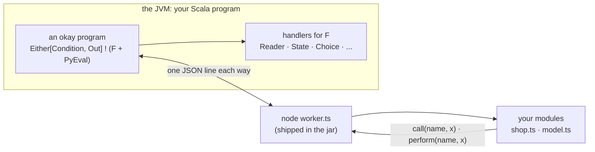

# okay with TypeScript

okay is an effects library for Scala 3. A program is a value, and
handlers decide what its operations mean. This page shows TypeScript
taking part in such a program. A Scala program calls TypeScript functions
as typed Scala functions. The TypeScript code calls back into okay's
effects in the middle of a call. And a TypeScript program can be written
as DATA, whose continuations okay may resume more than once.

TypeScript runs in its own Node process, which speaks okay's line
protocol: the same wire, and the same Scala API, as
[okay with Python and R](python-and-r.md). Node runs `.ts` files by
stripping their types, so there is no build step.

<!-- not-a-test: a diagram -->


## One set of types, three ways to run

Scala and TypeScript meet in three places:

| | Scala | TypeScript | a value crosses as |
|---|---|---|---|
| a Scala backend, a TypeScript frontend | the JVM | the browser | HTTP or WebSocket JSON |
| both in the browser | Scala.js | the browser | a JavaScript value, in-process |
| both on the backend | the JVM | a Node worker | the okay wire |

In all three, a value looks THE SAME to TypeScript: the shape okay's JSON
codec writes. A case class is an object, an enum case is
`{ "Case": {...} }`, `None` is `null`, and a `BigInt` is a string of
digits. So one declaration file, generated once from the Scala types,
types a TypeScript module in all three places:

```scala
def declarations: String = Stubs.typescript(summon[Schema[Order]], summon[Schema[Totals]], summon[Schema[Shape]])
```

A module typed only by it:

```typescript
export function area(s: Shape): number {
return "Rect" in s ? s.Rect.w * s.Rect.h : 3 * s.Circle.r * s.Circle.r;
}
```

On the JVM, `Ts` is the API that speaks this shape to a worker. It is
okay-py's `Py`, with the JSON codec as its shape:

```scala
val total = Ts.fn[Totals]("shop:total").calling(Ts.callbacks(priceOf))(Order("tea", 3L, None))
```

The test checks the claim literally. What the worker receives is
byte-for-byte the JSON an okay HTTP endpoint sends for the same value.
`tsc --strict` compiles the module above, and it refuses `s.Rect.width`.

This page's older examples use `Py.*` with `Stubs.typescriptWire`, the
worker's own wire shape (a sum carries a `type` field). Prefer `Ts` and
`Stubs.typescript`: one shape everywhere.

**Regenerated by the build.** The declarations belong in the frontend's
tree and are regenerated rather than edited. `StubFiles.typescript`
writes them, and rewrites the file only when its text changed, so an
unchanged model does not wake the frontend's watcher. A small `main`
lists the types:

<!-- not-a-test: an sbt setting, shown for the build it belongs in; StubFiles is tested in TestStubFiles -->
```scala
object WriteTypes:
  def main(args: Array[String]): Unit =
    StubFiles.typescript(Paths.get(args(0)), summon[Schema[Order]], summon[Schema[Shape]]): Unit

lazy val tsTypes = taskKey[Unit]("regenerate the frontend's types")
tsTypes := (Compile / runMain).toTask(" my.app.WriteTypes ../frontend/src/model.ts").value
```

`StubFiles.python` does the same for a Python worker's `TypedDict`s.

### Types written in TypeScript first

The other direction works too. A TypeScript developer writes the model:

```typescript
export interface User {
id: number;
name: string;
email?: string;
tags: string[];
}

export type Event = { Joined: Joined } | { Left: Left };
```

`TsTypes.scala(source, pkg)` reads it and writes the Scala: `User`
becomes a `final case class ... derives Schema`, with `email` as an
`Option[String] = None`, and `Event` becomes an `enum` with cases
`Joined` and `Left`.

It reads the declaration subset that describes DATA:
- interfaces;
- a union of `{ Case: Case }` (the shape okay's JSON gives a sum);
- `T[]`;
- `T | null`;
- optional fields.

Anything else is refused by name and line, never guessed: generics,
intersections, methods, maps, and string-literal unions (whose JSON
shape is not a Scala enum's).

**The round trip is exact.** `Stubs.typescript` names the Scala leaves
TypeScript would otherwise collapse: `Int`, `Long`, `Char`,
`BigIntDigits` and `Base64`, declared as `export type Long = number`,
and so on. TypeScript still sees plain numbers and strings, and reading
the declarations back gives the same Scala types. The test goes Scala to
TypeScript to Scala and gets the original types. That Scala is a golden
file which compiles, and its own TypeScript equals the first TypeScript
byte for byte.

A check that two hand-written copies still agree is the next stage
([specs/typescript-types.md](../specs/typescript-types.md)).

## A module

```typescript
import { call, done, perform, then, type Prog } from "./okay.ts";
import type { Order, Shape, Totals } from "./model.ts";

export function total(order: Order): Totals {
  const price = call<number>("price_of", order.sku);
  return { sku: order.sku, amount: price * Number(order.qty), note: null };
}
```

- **`./okay.ts`** is okay's TypeScript library. It ships in the jar, and
  `TsWorker.start` writes it beside your modules.
- **`call("price_of", sku)`** calls back into okay. It runs the callback
  the Scala side offered under that name, as an okay program under the
  caller's handlers, and returns its answer.
- **`./model.ts`** holds the types of the values, generated from the Scala
  `Schema`s:

```scala
val model = Stubs.typescriptWire(summon[Schema[Order]], summon[Schema[Totals]], summon[Schema[Shape]])
```

## From Scala

```scala
private lazy val w = TsWorker.start(dir, modules = Seq("shop"))
```

```scala
val priceOf = Py.callback[String, Double]("price_of")(sku => Reader.ask[Map[String, Double]].map(_(sku)))
val total = Py.fn[Totals]("shop:total").calling(Py.callbacks(priceOf))(Order("tea", 3L))
assertEquals(Reader.run(Map("tea" -> 4.0))(total).runWith, Right(Totals("tea", 12.0, None)))
```

The API is okay-py's, because the wire is. `Py.fn` makes a typed call,
`Py.callback` offers a callback, `Py.hold` keeps an object in the worker,
`Py.program` runs a program as data, and `Durable` journals any of them.
What the name in `call("price_of", ...)` is, and why a callback is a
name rather than a function, is explained in
[okay with Python and R](python-and-r.md#what-is-the-name-in-okaycallprice_of-x).

## Programs as data, many answers

```typescript
export function pairs(): Prog<number> {
  return then(perform<number>("choose", [1, 2]), (x) =>
    then(perform<number>("choose", [10, 20]), (y) => done(x + y)));
}
```

The worker keeps each continuation under an id, so okay's `Choice`
handler can continue the same one twice and gets every combination:

```scala
assertEquals(runChoice(pairs.program).runWith.toList, List(Right(11L), Right(21L), Right(12L), Right(22L)))
```

## Objects, async, errors, numbers

- **Held objects.** `Py.hold("shop:counter")()` keeps a `Counter` in the
  worker, and its methods and fields are reached by name.
- **Async functions.** An async function (a `Promise`) is awaited.
- **Errors.** An exception is a condition by name, and the worker lives
  on:

  ```scala
  assertEquals(Py.fn[Long]("shop:fail")().runWith, Left(Condition("RangeError", "typescript says no")))
  ```

- **Numbers.** An integer past 2^53 crosses as a `bigint`, so its declared
  type is `number | bigint`. Bytes cross as a `Uint8Array`, and NaN stays
  NaN.

## Types, checked by the real compiler

`Stubs.typescriptWire` declares the shapes TypeScript actually receives:
a sealed trait or enum is its case's object with `type: "Case"`, and
`None` is `null`. The test compiles the module above with
`tsc --strict`. It passes, and a read of `order.skuu` fails before
anything runs.

(`Stubs.typescript`, without `Wire`, declares what okay's JSON codec
writes instead, `{ "Case": {...} }`, for an HTTP API or a Scala.js
export. The two differ because the codecs do.)

## Inside okay, in the browser: no process at all

In a browser there is no worker to start, and none is needed. okay itself
runs there through Scala.js, and module `okay-ts` walks a TypeScript
program in the SAME JavaScript runtime. The program is the same
`done`/`perform`/`then` objects. Here it is as the JavaScript TypeScript
compiles to:

```javascript
pairs: () => then(perform("choose", [1, 2]), (x) =>
then(perform("choose", [10, 20]), (y) => done(x + y))),
```

```scala
val answers = !.run(runChoice(Ts.run[Choose, Long](programs.pairs(), Ts.callbacks(choose))))
```

The continuations are plain JavaScript functions, so okay's `Choice`
continues one twice here as well, and gets all four answers. A named
operation is an okay callback run under the caller's handlers:

```scala
val priceOf = Ts.callback[String, Double]("price_of")(sku => Reader.ask[Map[String, Double]].map(_(sku)))
```

In-process, values cross the way okay's JSON codec writes them, so their
types are `Stubs.typescript`'s: a sum is `{ "Rect": { w, h } }`. A
JavaScript exception is a `Left(Failure(name, message))`.

## okay, called from TypeScript

The other direction: `Ts.promise(program)` runs an okay `A ! Async` and
hands TypeScript a `Promise` of its value. An `@JSExportTopLevel`
function returning it is an okay program a TypeScript caller simply
`await`s, and its type is again `Stubs.typescript`'s:

```scala
val program = okay.pure[Async, Totals](Totals("tea", 12.0, None))
```

## TypeScript libraries, used from okay

To call an existing TypeScript library from okay on Scala.js, generate
Scala.js facades from its `.d.ts` with ScalablyTyped (a separate sbt
plugin, not part of okay). Then use the library from an okay program
like any Scala.js API. This path is not built or tested here, so it is a
pointer, not a promise.

## The limits, stated

- **Callbacks in async code.** A callback is synchronous: the worker
  reads its stdin with `readSync`, so `call` simply returns. Inside an
  async function, a `call` made after the function's first `await` is
  outside the call that offered it, and is refused by name.
- **Modules load at start.** They are imported once, when the worker
  starts. A callback's nested request is served synchronously, and an
  `import` is not.
- **okay-js prints JavaScript, not TypeScript.** Its typed tree has no
  type annotations yet (backlog polyglot-typescript).

The design and the results: [specs/typescript.md](../specs/typescript.md).
